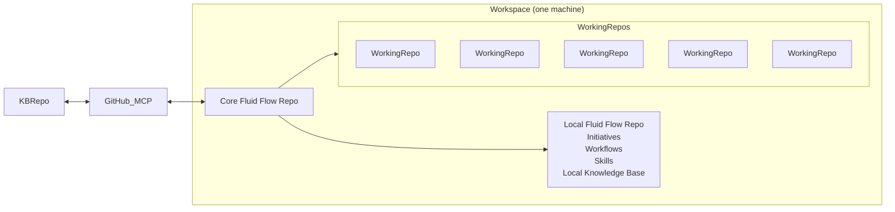
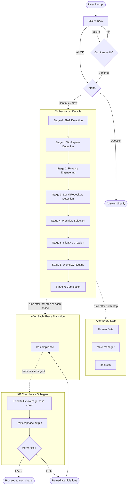

# Fluid Flow v0.9

AI-driven development workflow framework. Single entry point, staged lifecycle, pluggable workflows, and a shared knowledge base that governs every step.

## Overview

Fluid Flow is a framework for running AI-assisted development as a **repeatable, gated lifecycle** instead of freeform chat.

If you only remember one thing:
- **Core runs the process** (orchestrates stages + workflows)
- **Local stores the work** (all initiative artifacts live outside Core, under `initiatives/`)

### Overall structure (what lives where)

| Component | Where it lives | What it contains | Why it exists |
|----------|----------------|------------------|---------------|
| **Core Fluid Flow repo** | This repository (`fluid-flow-ai-core/`) | Orchestrator, core workflows, core knowledge base, primitives | Runs the lifecycle and enforces gates |
| **Local fluid-flow repo** | A separate folder (often a separate git repo) | `initiatives/` (artifacts + metadata), optional local KB/skills/workflows | Stores durable work outputs without cluttering Core |
| **Working repo(s)** | Your product/code repositories | Application code | The thing you actually change and ship |
| **External KB repo** | A separate repo (typically on GitHub) | Shared knowledge-base content | Lets teams centralize and version the KB independently of Core |

### Quick start (5 minutes)

1. **Have these three folders available**
   - `fluid-flow-ai/` (Core framework)
   - a **local fluid-flow repo** folder with `initiatives/` (where artifacts will be written)
   - one or more **working repo(s)** (the code you want to change)

2. **Create your local repo (once)**
   - Create a folder (often its own git repo)
   - Ensure it contains `initiatives/`
   - Optional: copy the starter kit from `local-fluid-flow/` (see `local-fluid-flow/README.md`)

3. **Open a multi-root workspace**
   - Open Core + your local repo + your working repo(s) in the same VS Code/Cursor workspace (example below)

4. **Start a development request**
   - Ask for a feature / change as normal
   - When prompted, select your local fluid-flow repo folder so Fluid Flow can create the initiative artifacts there
   - Pick an appropriate workflow and proceed step-by-step through the gates

### VS Code workspace example (recommended)

A common setup is to open a **multi-root workspace** that includes:
- `fluid-flow-ai/` (Core)
- a local fluid-flow repo (initiatives + artifacts)
- one or more working repos (the real code you change)

Example workspace layout:

```
  fluid-flow-ai/                  # Core framework (this repo)
  local-fluid-flow/               # Local fluid-flow repo (initiatives live here)
    knowledge-base-local
    initiatives/
    workflows/
  my-working-repo 1/              # Your application/product repo
  my-working-repo 2/              # Your application/product repo
  my-working-repo 3/              # Your application/product repo
  my-working-repo 4/              # Your application/product repo
```

Example `.code-workspace` (multi-root):

```json
{
  "folders": [
    { "path": "fluid-flow-ai-core" },
    { "path": "local-fluid-flow" },
    { "path": "my-working-repo 1" },
    { "path": "my-working-repo 2" },
    { "path": "my-working-repo 3" },
    { "path": "my-working-repo 4" }
  ]
}
```

## Core concepts

| Concept | What it does |
|--------|-------------|
| **Orchestrator** | Routes every request through a staged lifecycle (Stages 0-7) and enforces a human gate after every step |
| **Knowledge Base** | Shared rules for AI governance, security, quality, and review — loaded before steps and validated at phase boundaries |
| **Workflows** | Pluggable phase/step sequences tailored to specific scenarios (e.g. fast-track features, front-end migration) |
| **Initiatives** | Per-request artifact folders stored in a separate local fluid-flow repository (per team/domain) that track state, audit logs, and analytics |

## Guardrails

- **Human Gate**: the agent stops after every step and waits for explicit approval before continuing
- **No-Assumption Policy**: missing or ambiguous inputs are clarified before planning or implementation proceeds

## Core + Local Repos (At a Glance)

Fluid Flow Core is the shared framework that orchestrates work in your workspace. It connects to a selected local fluid-flow repository (initiative artifacts) and can analyze one or more working repositories.



## How It Works

Fluid Flow always follows the same high-level loop:
- **Check integrations** (MCP) → **triage intent** (question vs development) → **run the lifecycle** (Stages 0–7)
- **After every step**: Human Gate → state-manager → analytics
- **At phase boundaries**: kb-compliance validates outputs against the knowledge base



If you’re new to Fluid Flow, start with `local-fluid-flow/README.md` to understand (and set up) the **local fluid-flow repository** where initiatives and artifacts live.

## Knowledge Base

The knowledge base (`knowledge-base-core/`) contains the rules that govern AI behaviour across all workflows. It is organised by concern:

| Concern | What it covers |
|---------|---------------|
| **ai-governance/** | AI operating contract, overconfidence prevention, content validation, ADR integrity, continuous learning |
| **review/** | AI self-review checklist, human approval gate |
| **quality/** | ISO 9001 quality management, ISO 50001 energy management |
| **security/** | ISO 27001 compliance, authentication/authorization, data classification, secrets, threat modelling, VAPT report template, and more |

The knowledge base is enforced through two layers:

1. **Pre-step (tiered loading)** -- before each step, the main agent loads a subset of KB files into its context. The "Always Load" set covers governance and review basics. Conditional files (security, energy) load only when relevant.

2. **Post-phase (compliance subagent)** -- after the last step of each phase (phase transitions), a dedicated subagent loads the *entire* KB in its own context window, reviews the phase output, and returns a PASS/FAIL verdict. This catches violations without inflating the main conversation's context while avoiding redundant checks at every step.

The loading rules are defined in `knowledge-base-core/manifest.md`.

## Workflows

Workflows are pluggable phase/step sequences that define *how* a specific type of development work is done. The orchestrator selects the right workflow at Stage 4 and executes it at Stage 6.

Each workflow follows a consistent structure:

```
workflow/{workflow-name}/
  wf-{name}.md                -- workflow definition (frontmatter + metadata)
  {N}-{phase}/
    {N}-{phase}.md            -- phase orchestrator
    {N}-{step}/
      {N}-{step}.md           -- step instructions
```

Phases execute in order. Within each phase, steps execute in order. After every step the orchestrator runs the **Human Gate** (mandatory user validation), then state-manager and analytics. After the last step of each phase (phase transition), it additionally runs kb-compliance via a dedicated subagent.

## Local Repository and Initiatives

Initiative artifacts do **not** live inside `fluid-flow-ai-core`. Each team or domain maintains its own **local fluid-flow repository** -- a separate folder that holds all initiative data. This keeps the core repo clean as shared infrastructure.

To set up (or understand) a local repo, read `local-fluid-flow/README.md`.

At Stage 3, the orchestrator ensures a local repository exists and is usable:
- It asks you to **select an existing folder** (often a separate git repo) or **create a new one**
- It validates the folder contains an `initiatives/` directory (creating it if needed)
- It remembers your selection for future runs (so you don’t have to re-enter it each time)

This repository also includes a small **reference kit** at `local-fluid-flow/` (empty `knowledge-base-local/`, `skills/`, `initiatives/`, and `workflows/` folders) that you can copy into your local repo. It is **reference-only** — do not configure Fluid Flow to use this folder inside Core.

An initiative is a single unit of work (a feature, a bug fix, a migration). When the orchestrator creates an initiative at Stage 5, it sets up a folder inside the local repository:

```
{local-repo}/
  initiatives/
    {type}/{name}/              -- e.g. feature/DIT-179-budget-stage5
      metadata/
        state.md                -- progress tracking (which stages/steps are done)
        audit.md                -- append-only log of every interaction
        analytics.md            -- stage timeline, metrics, effort breakdown
```

- **state.md** -- checkbox-based progress tracker. Updated after every stage/step. Used to resume interrupted initiatives.
- **audit.md** -- append-only log with timestamp, user input (verbatim), AI response, and context for every interaction. Never summarised or overwritten.
- **analytics.md** -- stage timeline with start/end timestamps, interaction counts, approval counts, effort breakdown by phase, and cycle summary.

Initiative names follow the pattern `{type}/{jira-ticket}-{short-description}` (e.g. `feature/DIT-179-budget-stage5`).

## Skills

Skills are reusable capabilities the orchestrator loads at specific stages:

| Skill | Used at | Purpose |
|-------|---------|---------|
| `shell-detection/` | Stage 0 | Detect OS and shell type (bash vs PowerShell) for script routing |
| `reverse-engineering/` | Stage 2 | Analyse brownfield codebases via dedicated subagents; generate 11 design artifacts per repository |
| `jira-ff-assisted/` | Autonomous (any JIRA interaction) | Flag JIRA issues with the "FF Assisted" custom field to track AI-assisted development (non-blocking, idempotent) |
| `retrospective/` | After Stage 7 (recommended) | Generate an 8-dimension retrospective and improvement backlog from the completed workflow |

## Entry Points

| File | Purpose |
|------|---------|
| `.cursor/rules/instructions.mdc` | Cursor IDE -- loads orchestrator on every dev request |
| `.github/copilot-instructions.md` | GitHub Copilot -- loads orchestrator on every dev request |
| `orchestrator.md` | Single entry point for all development work |

## Directory Structure

### Core Repository (`fluid-flow-ai-core`)

```
fluid-flow-ai-core/
  orchestrator.md               -- main entry point
  knowledge-base-core/
    manifest.md                 -- loading manifest (tiered + post-step strategy)
    ai-governance/              -- AI operating contract, overconfidence, no-assumption policy, ADR gate, content validation
    review/                     -- AI self-review, human approval gate
    quality/                    -- ISO 9001, ISO 50001
    security/                   -- ISO 27001, authz, secrets, threat model, etc.
  primitives/
    human-gate.md               -- mandatory user validation after every step
    state-manager.md            -- manages state.md + audit.md per initiative
    analytics.md                -- manages analytics.md per initiative
    kb-compliance.md            -- post-phase KB compliance via subagent
    risk-report.md              -- change risk report for CAB review (Stage 7)
    vapt.md                     -- vulnerability assessment & penetration testing (Stage 7)
  skills/
    shell-detection/            -- detect bash vs powershell
    reverse-engineering/        -- brownfield codebase analysis
    jira-ff-assisted/           -- flag JIRA issues with "FF Assisted" custom field
    retrospective/              -- 8-dimension workflow retrospective and improvement backlog
  workflow/
    {workflow-name}/
      wf-{name}.md             -- workflow definition
      {N}-{phase}/
        {N}-{phase}.md          -- phase orchestrator
        {N}-{step}/
          {N}-{step}.md         -- step instructions
  templates/
    branch-template.md          -- initiative naming convention
```

### Local Fluid-Flow Repository (per domain/area)

```
{local-repo-name}/              -- e.g. fluid-flow-data, fluid-flow-platform
  initiatives/
    {type}/{name}/              -- e.g. feature/DIT-179-budget-stage5
      metadata/
        state.md                -- progress tracking
        audit.md                -- interaction log
        analytics.md            -- workflow metrics
      artefacts/                -- workflow step outputs
```
