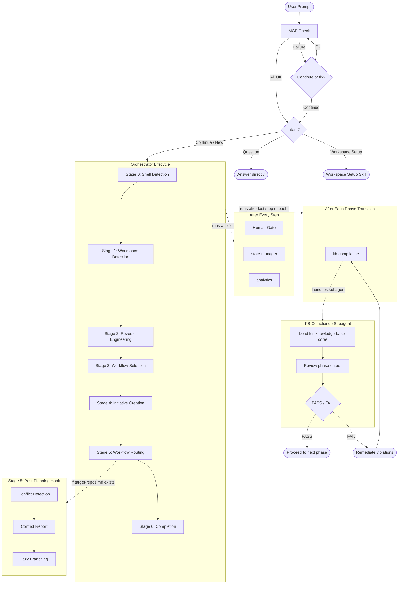

# Fluid Flow v1.0

AI-driven development workflow framework. Single entry point, staged lifecycle, pluggable workflows, and a shared knowledge base that governs every step. v1.0 extends the framework to operate across **Fluid Flow Workspaces** — multiple repositories orchestrated through a dedicated workspace repo.

## Overview

Fluid Flow is a framework that structures how AI assistants collaborate with humans on software development. Instead of freeform conversation, every development request follows a repeatable lifecycle with explicit stages, approval gates, and compliance checks.

The framework has four pillars:

| Pillar | What it does |
|--------|-------------|
| **Orchestrator** | Routes every request through a staged lifecycle (Stages 0-6) with a mandatory human gate after every step |
| **Knowledge Base** | Shared rules for AI governance, security, quality, and review — loaded before steps and validated at phase boundaries |
| **Workflows** | Pluggable phase/step sequences tailored to specific development scenarios (e.g. front-end migration, cross-workspace initiatives) |
| **Initiatives** | Per-request artifact folders that track state, audit logs, and analytics throughout the lifecycle |

Core principles:
- **Human Gate**: the agent stops after every step and waits for explicit user approval before continuing
- **No-Assumption Policy**: the agent never uses "best judgment" to fill gaps — it always asks the user for clarification when information is missing or ambiguous

## What v1.0 Adds

v1.0 is additive — everything from v0.9 is preserved. The orchestrator lifecycle, knowledge base, primitives, existing workflows, and initiative structure are unchanged.

| Capability | What it does |
|------------|-------------|
| **Fluid Flow Workspace** | A dedicated repo per bounded context that hosts Fluid Flow, all initiative artifacts, and the workspace file |
| **ff-workspace.yaml** | Auto-generated workspace composition file — repos, teams, governance, shared repo flags |
| **Workspace Setup** | New triage intent that bootstraps a Fluid Flow Workspace from a multi-root VS Code workspace |
| **Cross-Repo RE** | Per-repo RE artifacts (unchanged) + combined architecture view in the workspace |
| **Conflict Detection** | Pre-construction skill comparing active initiatives for contract and file conflicts |
| **Lazy Branching** | Workspace repo branched at inception; target repos branched only at construction |
| **Multi-Workspace Workflow** | New pluggable workflow for cross-workspace planning using the org-level domain catalog |
| **Incident Learnings** | New RE artifact capturing production feedback for agent context |

## How It Works



## Fluid Flow Workspace

A Fluid Flow Workspace is a dedicated repository per bounded context (or any logical grouping of related repos). It contains no application code. It hosts Fluid Flow and all initiative artifacts.

Individual repos retain their own `reverse-engineering/` artifacts (per-repo detail). The workspace adds combined architecture views on top.

### When to Use

- Your development spans multiple repositories in the same domain
- You want unified codebase awareness across repos
- You want cross-repo initiative specs and conflict detection
- You want a single source of truth for Fluid Flow (no copies in each repo)

### Workspace Setup

When the orchestrator detects a multi-root workspace with no `ff-workspace.yaml`, it prompts for workspace setup. The setup skill:
1. Reads the `.code-workspace` file for the repo list
2. Runs RE across all repos with parallel subagents
3. Produces combined architecture views
4. Generates `ff-workspace.yaml` from RE findings
5. Discovers shared repos via GitHub MCP (optional)
6. Presents everything for human review

## Context Loading Strategy

v1.0 introduces workspace-level artifacts that could bloat the agent's context if loaded indiscriminately. The framework follows a tiered loading principle: **load the map, not the territory**.

- `ff-workspace.yaml` is always loaded at Stage 1 — it's the map of what repos exist
- `combined-architecture.md` loads on demand during planning phases with cross-repo scope
- `incident-learnings.md` loads filtered to only the repos in the current initiative
- Per-repo RE artifacts load only in implementation subagents scoped to that repo
- `combined-c4.md` never loads proactively — only on explicit architectural queries

Each subagent type has strict context isolation (only sees what it needs). The full rules are defined in `knowledge-base-core/manifest.md` § Workspace Artifacts, and each workflow step declares its own loading table.

## Knowledge Base

The knowledge base (`knowledge-base-core/`) contains the rules that govern AI behaviour across all workflows. It is organised by concern:

| Concern | What it covers |
|---------|---------------|
| **ai-governance/** | AI operating contract, overconfidence prevention, content validation, ADR integrity, continuous learning |
| **review/** | AI self-review checklist, human approval gate |
| **quality/** | ISO 9001 quality management, ISO 50001 energy management |
| **security/** | ISO 27001 compliance, authentication/authorization, data classification, secrets, threat modelling, and more |

The knowledge base is enforced through two layers:

1. **Pre-step (tiered loading)** — before each step, the main agent loads a subset of KB files into its context. The "Always Load" set covers governance and review basics. Conditional files (security, energy) load only when relevant.

2. **Post-phase (compliance subagent)** — after the last step of each phase (phase transitions), a dedicated subagent loads the *entire* KB in its own context window, reviews the phase output, and returns a PASS/FAIL verdict. This catches violations without inflating the main conversation's context while avoiding redundant checks at every step.

The loading rules are defined in `knowledge-base-core/manifest.md`.

## Workflows

Workflows are pluggable phase/step sequences that define *how* a specific type of development work is done. The orchestrator selects the right workflow at Stage 3 and executes it at Stage 5.

Each workflow follows a consistent structure:

```
workflow/{workflow-name}/
  wf-{name}.md                -- workflow definition (frontmatter + metadata)
  {N}-{phase}/
    {N}-{phase}.md            -- phase orchestrator
    {N}-{step}/
      {N}-{step}.md           -- step instructions
```

Phases execute in order. Within each phase, steps execute in order. After every step the orchestrator runs the **Human Gate** (mandatory user validation), then state-manager and analytics. After the last step of each phase (phase transition), it additionally runs kb-compliance via a dedicated subagent.

### Available Workflows

| Workflow | Domain | Description |
|----------|--------|-------------|
| `fast-track` | general | Streamlined feature development — specification, planning, task decomposition, quality checks, and implementation |
| `fe-migration-angular-stencil` | front-end | Migrate Angular widgets to StencilJS MFEs with structured analysis, planning, and implementation |
| `multi-workspace` | orchestration | Cross-workspace planning — domain impact analysis, contract design, and workspace spec generation |

## Initiatives

An initiative is a single unit of work (a feature, a bug fix, a migration). When the orchestrator creates an initiative at Stage 4, it sets up a folder with metadata artifacts that track the full lifecycle:

```
initiatives/{type}/{name}/
  metadata/
    state.md                  -- progress tracking (which stages/steps are done)
    audit.md                  -- append-only log of every interaction
    analytics.md              -- workflow metrics
  artefacts/                  -- step outputs
  target-repos.md             -- which repos this initiative affects (workspace mode)
```

- **state.md** — checkbox-based progress tracker. Updated after every stage/step. Used to resume interrupted initiatives.
- **audit.md** — append-only log with timestamp, user input (verbatim), AI response, and context for every interaction. Never summarised or overwritten.
- **analytics.md** — stage timeline with start/end timestamps, interaction counts, approval counts, effort breakdown by phase, and cycle summary.
- **target-repos.md** — (workspace mode) which repos the initiative affects, with planned changes and dependency order.

Initiative names follow the pattern `{type}/{jira-ticket}-{short-description}` (e.g. `feature/DIT-179-budget-stage5`).

## Skills

Skills are reusable capabilities the orchestrator loads at specific stages:

| Skill | Used at | Purpose |
|-------|---------|---------|
| `shell-detection/` | Stage 0 | Detect OS and shell type (bash vs PowerShell) for script routing |
| `reverse-engineering/` | Stage 2 | Analyse brownfield codebases via dedicated subagents; generate 11 design artifacts per repo + combined workspace architecture |
| `branch-creation/` | Stage 4/5 | Create initiative branches following naming conventions |
| `workspace-setup/` | Triage | Bootstrap a Fluid Flow Workspace from a multi-root VS Code workspace |
| `conflict-detection/` | Stage 5 | Compare active initiatives for contract, file, and data flow conflicts before construction |

## Conflict Detection

When a workflow's planning phase produces `target-repos.md`, the conflict detection skill runs before construction. It:

1. Reads `ff-workspace.yaml` for repo list and shared repo flags
2. Reads `combined-architecture.md` for cross-repo relationships
3. Scans all active initiatives for overlapping targets
4. Produces a conflict report with severity levels: BLOCKING, HIGH, MEDIUM, CROSS-CONTEXT, LOW
5. For BLOCKING or CROSS-CONTEXT: the human gate cannot be skipped

## Lazy Branching

In workspace mode, branches are created lazily:
- **Stages 0-4**: branch exists in the Fluid Flow Workspace only
- **Stage 5 (post-planning)**: conflict detection runs, then branches are created in target repos
- **Same branch name** across all repos for traceability
- **Stage 6**: PRs created per target repo in dependency order

## Entry Points

| File | Purpose |
|------|---------|
| `.cursor/rules/instructions.mdc` | Cursor IDE — loads orchestrator on every dev request |
| `.github/copilot-instructions.md` | GitHub Copilot — loads orchestrator on every dev request |
| `orchestrator.md` | Single entry point for all development work |

## Directory Structure

```
fluid-flow-ai/
  orchestrator.md               -- main entry point (v1.0)
  ff-workspace.yaml             -- generated workspace composition (workspace mode)

  knowledge-base-core/
    manifest.md                 -- loading manifest (tiered + post-step strategy)
    ai-governance/              -- AI operating contract, overconfidence, no-assumption policy, ADR gate, content validation
    review/                     -- AI self-review, human approval gate
    quality/                    -- ISO 9001, ISO 50001
    security/                   -- ISO 27001, authz, secrets, threat model, etc.

  primitives/
    human-gate.md               -- mandatory user validation after every step
    state-manager.md            -- manages state.md + audit.md per initiative
    analytics.md                -- manages analytics.md per initiative
    kb-compliance.md            -- post-phase KB compliance via subagent

  skills/
    shell-detection/            -- detect bash vs powershell
    reverse-engineering/        -- brownfield codebase analysis + combined workspace views
      templates/
        business-overview.md
        architecture.md
        c4-architecture.md
        code-structure.md
        api-documentation.md
        component-inventory.md
        technology-stack.md
        dependencies.md
        code-quality-assessment.md
        test-coverage-analysis.md
        reverse-engineering-timestamp.md
        combined-architecture.md  -- workspace-level template
        combined-c4.md            -- workspace-level template
        incident-learnings.md     -- production feedback template
    branch-creation/            -- initiative branch creation
    workspace-setup/            -- bootstrap Fluid Flow Workspace (v1.0)
    conflict-detection/         -- pre-construction conflict detection (v1.0)

  workflow/
    fast-track/                 -- streamlined feature development (v1.0)
      wf-fast-track.md
      knowledge-core/           -- constitution template
      templates/                -- spec, plan, tasks, checklist templates
      scripts/                  -- bash and powershell helper scripts
      1-inception/              -- 4 steps: specify, clarify, plan, tasks
      2-quality/                -- 2 steps: checklist, analyze
      3-construction/           -- 1 step: implement
    fe-migration-angular-stencil/
      wf-fe-migration-angular-stencil.md
      1-inception/              -- 6 steps
      2-construction/           -- 5 steps
      3-qa/                     -- 2 steps
    multi-workspace/            -- cross-workspace planning (v1.0)
      wf-multi-workspace.md
      1-scope/                  -- domain impact analysis
      2-decompose/              -- per-workspace scope
      3-contracts/              -- cross-workspace contract design
      4-sequence/               -- delivery order
      5-seed/                   -- per-workspace spec stubs

  initiatives/
    {type}/{name}/              -- e.g. feature/DIT-179-budget-stage5
      metadata/
        state.md                -- progress tracking
        audit.md                -- interaction log
        analytics.md            -- workflow metrics
      artefacts/                -- step outputs
      target-repos.md           -- target repos (workspace mode)

  reverse-engineering/          -- combined workspace-level RE (workspace mode)
    combined-architecture.md    -- cross-repo architecture view
    combined-c4.md              -- C4 where containers = repos
    incident-learnings.md       -- production feedback

  templates/
    branch-template.md          -- initiative naming convention
```
