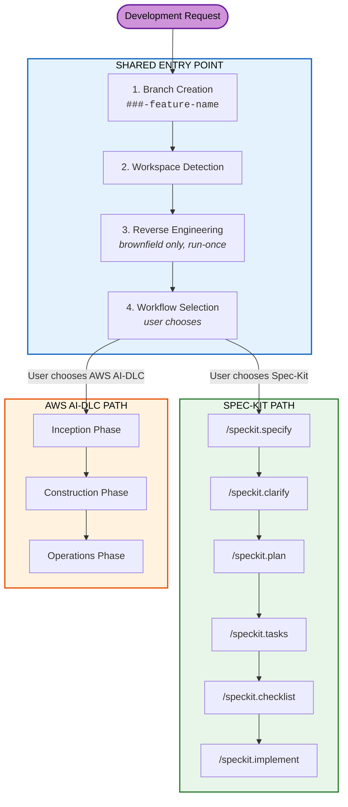

# Fluid Flow AI

**Adaptive Software Development Workflow for AI-Assisted Engineering**

Fluid Flow AI is a structured, governance-aware workflow framework that guides AI-assisted software development from requirements through implementation. It provides a unified entry point where the developer chooses one of two workflow paths, while enforcing compliance, security, and quality standards at every stage.

---

## Key Features

- **Unified Entry Point** -- Every development request flows through a single, standardised process regardless of complexity
- **Dual Workflow Paths** -- Spec-Kit for streamlined features; AWS AI-DLC for complex enterprise work
- **User-Driven Routing** -- The developer directly chooses which workflow to follow for each feature
- **Full Audit Trail** -- Every interaction, decision, and approval is logged with ISO 8601 timestamps
- **Governance Backbone** -- ISO 27001 (security), ISO 9001 (quality), and ISO 50001 (energy) compliance built in
- **Brownfield Intelligence** -- Automatic codebase reverse engineering with C4 architecture modelling
- **Human-in-the-Loop** -- AI proposes, humans decide. Approval gates at every critical stage
- **State Tracking** -- Real-time progress tracking per feature with resume capability

---

## How It Works

### Shared Entry Point (All Requests)

1. **Branch Creation** -- A numbered feature branch (`001-add-user-auth`) and dedicated feature directory are created
2. **Workspace Detection** -- The workspace is scanned to determine if the project is greenfield or brownfield
3. **Reverse Engineering** -- For brownfield projects, the existing codebase is analysed once to produce architecture documentation (C4 model, component inventory, API docs, etc.)
4. **Workflow Selection** -- The user is presented with both workflow options and directly chooses which one to follow

### Spec-Kit Path (Simpler Features)

A streamlined specification-to-implementation pipeline with six commands:

| Command | Purpose |
|---------|---------|
| `/speckit.specify` | Convert natural language to a structured specification |
| `/speckit.clarify` | Identify and resolve ambiguities interactively |
| `/speckit.plan` | Generate an implementation plan with data models and contracts |
| `/speckit.tasks` | Break the plan into ordered, dependency-aware tasks |
| `/speckit.checklist` | Generate quality checklists for specific domains |
| `/speckit.implement` | Execute implementation with progress tracking |

### AWS AI-DLC Path (Complex Enterprise Work)

A comprehensive SDLC with three phases and adaptive depth:

| Phase | Stages |
|-------|--------|
| **Inception** | Requirements Analysis, Onboarding Presentations, User Stories, Workflow Planning, Application Design, Units Generation |
| **Construction** | Per-unit loop: Functional Design, NFR Requirements, NFR Design, Infrastructure Design, Code Generation, Onboarding Update. Then: Build & Test, RE Update |
| **Operations** | Placeholder for deployment and monitoring workflows |

---

## Quick Start

1. **Install in your project** -- Copy the `fluid-flow-ai/` directory into your workspace
2. **Ensure Cursor IDE** -- Fluid Flow AI is designed for [Cursor](https://cursor.sh/) with its rules engine
3. **Start developing** -- Make any development request. The workflow rule triggers automatically before any code changes

For detailed setup instructions, see [Getting Started](docs/GETTING-STARTED.md).

---

## Documentation

| Document | Description |
|----------|-------------|
| [Getting Started](docs/GETTING-STARTED.md) | Installation, prerequisites, and first-run guide |
| [Architecture](docs/ARCHITECTURE.md) | System design, component relationships, and data flow |
| [Workflows](docs/WORKFLOWS.md) | Detailed reference for both workflow paths |
| [Commands](docs/COMMANDS.md) | Complete command reference for Spec-Kit and AWS AI-DLC |
| [Reverse Engineering](docs/REVERSE-ENGINEERING.md) | Artifact reference with content descriptions and samples |
| [Governance](docs/GOVERNANCE.md) | Compliance standards, security rules, and review gates |
| [Directory Structure](docs/DIRECTORY-STRUCTURE.md) | File and folder layout reference |

---

## Core Principles

| Principle | Description |
|-----------|-------------|
| **AI Proposes, Humans Decide** | AI is a non-accountable assistant. Final decisions rest with humans. |
| **Adaptive Execution** | The workflow adapts to the work -- only stages that add value are executed |
| **Transparent Planning** | The execution plan is always shown before starting |
| **User Control** | Users choose their workflow and can include/exclude stages |
| **Complete Audit Trail** | Every interaction is logged with timestamps -- nothing is summarised |
| **Content Validation** | All generated content (Mermaid diagrams, markdown) is validated before writing |
| **No Emergent Behaviour** | Standardised completion messages -- no invented navigation patterns |

---

## Technology

Fluid Flow AI is a **process framework**, not a traditional software application. It is composed of:

- **Markdown** -- Workflow definitions, memory files, templates, and governance rules
- **Cursor Rules** (`.mdc` files) -- IDE-level workflow enforcement
- **Bash Scripts** -- Automation for branch creation, prerequisite checks, and setup
- **Mermaid** -- All diagrams use Mermaid syntax for consistency and portability

It is language- and platform-agnostic. The framework includes technology-specific guidelines for .NET/C#, and Terraform, but the workflow itself applies to any stack.

---

## License

This project is proprietary. All rights reserved.
