# Fluid Flow AI v0.1.2

**Adaptive Software Development Workflow for AI-Assisted Engineering**

Fluid Flow AI is a structured, governance-aware workflow framework that guides AI-assisted software development from requirements through implementation. It provides a unified entry point where the developer chooses one of two workflow paths, while enforcing compliance, security, and quality standards at every stage.

---

## Key Features

- **Unified Entry Point** -- Every development request flows through a single, standardised process regardless of complexity
- **Dual Workflow Paths** -- Fast-Track for streamlined features; Comprehensive Path for complex enterprise work
- **User-Driven Routing** -- The developer directly chooses which workflow to follow for each feature
- **Technical Scoping & Engineering Discovery** -- Optional Comprehensive Path stage that assesses engineering complexity, identifies risk signals, and recommends decomposition into sub-initiatives before any design work begins
- **Full Audit Trail** -- Every interaction, decision, and approval is logged with ISO 8601 timestamps
- **Governance Backbone** -- ISO 27001 (security), ISO 9001 (quality), and ISO 50001 (energy) compliance built in
- **Brownfield Intelligence** -- Automatic codebase reverse engineering with C4 architecture modelling
- **Human-in-the-Loop** -- AI proposes, humans decide. Approval gates at every critical stage
- **Change Risk Reporting** -- Automated CAB-grade risk reports enriched with full lifecycle context, not just the git diff
- **State Tracking** -- Real-time progress tracking per feature with resume capability

---

## How It Works

```mermaid
flowchart TD
    Request(["Development Request"])

    subgraph ENTRY["SHARED ENTRY POINT"]
        B1("1. Branch Creation")
        B2("2. Workspace Detection")
        B3("3. Reverse Engineering")
        B4("4. Workflow Selection")
        B1 --> B2 --> B3 --> B4
    end

    Request --> B1

    subgraph FASTTRACK["FAST-TRACK"]
        subgraph FT_INC["Inception"]
            FT1("Specify")
            FT2("Clarify")
            FT3("Plan")
            FT1 --> FT2 --> FT3
        end
        subgraph FT_CON["Construction"]
            FT4("Tasks")
            FT5("Checklist")
            FT6("Implement")
            FT4 --> FT5 --> FT6
        end
        FT3 --> FT4
    end

    subgraph COMP["COMPREHENSIVE"]
        subgraph CP_INC["Inception"]
            CP0("Technical Scoping<br/><i>Optional</i>")
            CP1("Requirements Analysis")
            CP2("Onboarding Presentations")
            CP3("User Stories")
            CP4("Workflow Planning")
            CP5("Application Design")
            CP6("Units Generation")
            CP0 --> CP1 --> CP2 --> CP3 --> CP4 --> CP5 --> CP6
        end
        subgraph CP_CON["Construction"]
            CP7("Functional Design")
            CP8("NFR Requirements")
            CP9("NFR Design")
            CP10("Infrastructure Design")
            CP11("Code Generation")
            CP12("Onboarding Update")
            CP13("Build & Test")
            CP7 --> CP8 --> CP9 --> CP10 --> CP11 --> CP12 --> CP13
        end
        CP6 --> CP7
    end

    subgraph FINISH["CONSTRUCTION — COMPLETION"]
        FC1("Commit")
        FC2("Pull Request")
        FC3("Change Risk Report")
        FC1 --> FC2 --> FC3
    end

    B4 -->|"Fast-Track"| FT1
    B4 -->|"Comprehensive"| CP0
    FT6 --> FC1
    CP13 --> FC1

    style Request fill:#CE93D8,stroke:#6A1B9A,stroke-width:2px
    style ENTRY fill:#90CAF9,stroke:#1565C0,stroke-width:2px,rx:10,ry:10
    style FASTTRACK fill:#81C784,stroke:#2E7D32,stroke-width:2px,rx:10,ry:10
    style FT_INC fill:#C8E6C9,stroke:#43A047,stroke-width:1px,rx:8,ry:8
    style FT_CON fill:#A5D6A7,stroke:#2E7D32,stroke-width:1px,rx:8,ry:8
    style COMP fill:#FFB74D,stroke:#E65100,stroke-width:2px,rx:10,ry:10
    style CP_INC fill:#FFE0B2,stroke:#FB8C00,stroke-width:1px,rx:8,ry:8
    style CP_CON fill:#FFCC80,stroke:#E65100,stroke-width:1px,rx:8,ry:8
    style FINISH fill:#B39DDB,stroke:#4527A0,stroke-width:2px,rx:10,ry:10
```



### Shared Entry Point (All Requests)

1. **Branch Creation** -- A feature branch (`GXD-1732-add-user-authentication-flow`) and dedicated feature directory are created
2. **Workspace Detection** -- The workspace is scanned to determine if the project is greenfield or brownfield
3. **Reverse Engineering** -- For brownfield projects, the existing codebase is analysed once to produce architecture documentation (C4 model, component inventory, API docs, etc.)
4. **Workflow Selection** -- The user is presented with both workflow options and directly chooses which one to follow

### Fast-Track Path (Simpler Features)

A streamlined specification-to-implementation pipeline with two phases:

| Phase | Commands | Purpose |
|-------|----------|---------|
| **Inception** | `/fasttrack.specify` | Convert natural language to a structured specification |
| | `/fasttrack.clarify` | Identify and resolve ambiguities interactively |
| | `/fasttrack.plan` | Generate an implementation plan with data models and contracts |
| **Construction** | `/fasttrack.tasks` | Break the plan into ordered, dependency-aware tasks |
| | `/fasttrack.checklist` | Generate quality checklists for specific domains |
| | `/fasttrack.implement` | Execute implementation with progress tracking |

### Comprehensive Path (Complex Enterprise Work)

A comprehensive SDLC with two phases and adaptive depth:

| Phase | Stages |
|-------|--------|
| **Inception** | Technical Scoping & Engineering Discovery (optional), Requirements Analysis, Onboarding Presentations, User Stories, Workflow Planning, Application Design, Units Generation |
| **Construction** | Per-unit loop: Functional Design, NFR Requirements, NFR Design, Infrastructure Design, Code Generation, Onboarding Update. Then: Build & Test |

### Completion (Both Paths)

After either workflow finishes, a shared completion stage runs:

1. **Commit** -- Stage and commit all changes with a conventional commit message
2. **Pull Request** -- Push the branch and create a PR targeting main
3. **Change Risk Report** -- Generate a CAB-grade risk report and attach it to the PR

The risk report analyses the complete `git diff` against the base branch, enriched with context accumulated throughout the lifecycle:

- **Executive Summary** -- Risk level (LOW to CRITICAL), business impact, and approval recommendation
- **Technical Risk Analysis** -- Infrastructure impact, operational risks, and change execution risks
- **LiveOps / NOC Monitoring** -- Pre-change checklist, real-time monitoring plan, and post-change validation windows (0-4h, 4-24h, 24-48h)
- **Rollback Strategy** -- Procedure, decision thresholds, and partial rollback options
- **AI Confidence Score** -- Breakdown by technical feasibility, risk identification, rollback capability, and more

The report can be regenerated at any time using `/fluid-flow.risk-report`, which supports both full and delta modes (analyse only changes since the last report).

---

## Quick Start

1. **Install in your project** -- Copy the `fluid-flow-ai/` directory into your workspace
2. **Configure your IDE** -- Fluid Flow AI works with any AI-capable IDE that supports rules or system prompts (e.g. Cursor, VS Code with GitHub Copilot). See [Getting Started](docs/GETTING-STARTED.md) for IDE-specific setup
3. **Start developing** -- Make any development request. The workflow triggers automatically before any code changes

For detailed setup instructions, see [Getting Started](docs/GETTING-STARTED.md).

---

## Documentation

| Document | Description |
|----------|-------------|
| [Getting Started](docs/GETTING-STARTED.md) | Installation, prerequisites, and first-run guide |
| [Architecture](docs/ARCHITECTURE.md) | System design, component relationships, and data flow |
| [Workflows](docs/WORKFLOWS.md) | Detailed reference for both workflow paths |
| [Commands](docs/COMMANDS.md) | Complete command reference for Fast-Track and Comprehensive Path |
| [Reverse Engineering](docs/REVERSE-ENGINEERING.md) | Artifact reference with content descriptions and samples |
| [Governance](docs/GOVERNANCE.md) | Compliance standards, security rules, and review gates |
| [Directory Structure](docs/DIRECTORY-STRUCTURE.md) | File and folder layout reference |
| [Changelog](CHANGELOG.md) | Release history and version changes |

---

## Releasing

Bump `VERSION`, add a new section to `CHANGELOG.md`, update the `README.md` title, then commit and tag:

```sh
git add CHANGELOG.md VERSION README.md
git commit -m "release: v{VERSION}"
git tag -a "v{VERSION}" -m "Release v{VERSION}"
git push && git push --tags
```

---

## Core Principles

| Principle | Description |
|-----------|-------------|
| **AI Proposes, Humans Decide** | AI is a non-accountable assistant. Final decisions rest with humans. |
| **Adaptive Execution** | The workflow adapts to the work -- only stages that add value are executed |
| **Transparent Planning** | The execution plan is always shown before starting |
| **User Control** | Users choose their workflow and can include/exclude stages |
| **Complete Audit Trail** | Every interaction is logged with timestamps -- nothing is summarised |
| **Content Validation** | All generated content (Mermaid diagrams, markdown) is validated before writing |
| **No Emergent Behaviour** | Standardised completion messages -- no invented navigation patterns |

---

## Technology

Fluid Flow AI is a **process framework**, not a traditional software application. It is composed of:

- **Markdown** -- Workflow definitions, memory files, templates, and governance rules
- **IDE Rules** (`.mdc` for Cursor, `.github/copilot-instructions.md` for VS Code; additional formats may be added) -- IDE-level workflow enforcement via AI rules or system prompts
- **Bash & PowerShell Scripts** -- Cross-OS automation for branch creation, prerequisite checks, and setup (auto-detected per OS)
- **Mermaid** -- All diagrams use Mermaid syntax for consistency and portability

It is language- and platform-agnostic. The framework includes technology-specific guidelines for .NET/C#, Terraform, and Coralogix (observability), but the workflow itself applies to any stack.

---

## License

This project is proprietary. All rights reserved.
