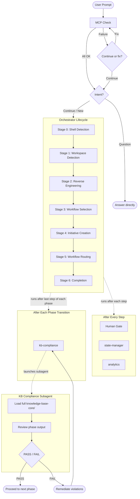

# Fluid Flow Core v0.9

AI-driven development workflow framework. Single entry point, staged lifecycle, pluggable workflows, and a shared knowledge base that governs every step.

## Overview

Fluid Flow Core is a framework that structures how AI assistants collaborate with humans on software development. Instead of freeform conversation, every development request follows a repeatable lifecycle with explicit stages, approval gates, and compliance checks.

The framework has four pillars:

| Pillar | What it does |
|--------|-------------|
| **Orchestrator** | Routes every request through a staged lifecycle (Stages 0-6) with a mandatory human gate after every step |
| **Knowledge Base** | Shared rules for AI governance, security, quality, and review -- loaded before steps and validated at phase boundaries |
| **Workflows** | Pluggable phase/step sequences tailored to specific development scenarios (e.g. front-end migration) |
| **Initiatives** | Per-request artifact folders that track state, audit logs, and analytics throughout the lifecycle |

Core principles:
- **Human Gate**: the agent stops after every step and waits for explicit user approval before continuing
- **No-Assumption Policy**: the agent never uses "best judgment" to fill gaps -- it always asks the user for clarification when information is missing or ambiguous

## How It Works



## Knowledge Base

The knowledge base (`knowledge-base-core/`) contains the rules that govern AI behaviour across all workflows. It is organised by concern:

| Concern | What it covers |
|---------|---------------|
| **ai-governance/** | AI operating contract, overconfidence prevention, content validation, ADR integrity, continuous learning |
| **review/** | AI self-review checklist, human approval gate |
| **quality/** | ISO 9001 quality management, ISO 50001 energy management |
| **security/** | ISO 27001 compliance, authentication/authorization, data classification, secrets, threat modelling, and more |

The knowledge base is enforced through two layers:

1. **Pre-step (tiered loading)** -- before each step, the main agent loads a subset of KB files into its context. The "Always Load" set covers governance and review basics. Conditional files (security, energy) load only when relevant.

2. **Post-phase (compliance subagent)** -- after the last step of each phase (phase transitions), a dedicated subagent loads the *entire* KB in its own context window, reviews the phase output, and returns a PASS/FAIL verdict. This catches violations without inflating the main conversation's context while avoiding redundant checks at every step.

The loading rules are defined in `knowledge-base-core/manifest.md`.

## Workflows

Workflows are pluggable phase/step sequences that define *how* a specific type of development work is done. The orchestrator selects the right workflow at Stage 3 and executes it at Stage 5.

Each workflow follows a consistent structure:

```
workflow/{workflow-name}/
  wf-{name}.md                -- workflow definition (frontmatter + metadata)
  {N}-{phase}/
    {N}-{phase}.md            -- phase orchestrator
    {N}-{step}/
      {N}-{step}.md           -- step instructions
```

Phases execute in order. Within each phase, steps execute in order. After every step the orchestrator runs the **Human Gate** (mandatory user validation), then state-manager and analytics. After the last step of each phase (phase transition), it additionally runs kb-compliance via a dedicated subagent.

## Initiatives

An initiative is a single unit of work (a feature, a bug fix, a migration). When the orchestrator creates an initiative at Stage 4, it sets up a folder with metadata artifacts that track the full lifecycle:

```
initiatives/{type}/{name}/
  metadata/
    state.md                  -- progress tracking (which stages/steps are done)
    audit.md                  -- append-only log of every interaction
    analytics.md              -- stage timeline, metrics, effort breakdown
```

- **state.md** -- checkbox-based progress tracker. Updated after every stage/step. Used to resume interrupted initiatives.
- **audit.md** -- append-only log with timestamp, user input (verbatim), AI response, and context for every interaction. Never summarised or overwritten.
- **analytics.md** -- stage timeline with start/end timestamps, interaction counts, approval counts, effort breakdown by phase, and cycle summary.

Initiative names follow the pattern `{type}/{jira-ticket}-{short-description}` (e.g. `feature/DIT-179-budget-stage5`).

## Skills

Skills are reusable capabilities the orchestrator loads at specific stages:

| Skill | Used at | Purpose |
|-------|---------|---------|
| `shell-detection/` | Stage 0 | Detect OS and shell type (bash vs PowerShell) for script routing |
| `reverse-engineering/` | Stage 2 | Analyse brownfield codebases via dedicated subagents; generate 11 design artifacts per repository |

## Entry Points

| File | Purpose |
|------|---------|
| `.cursor/rules/instructions.mdc` | Cursor IDE -- loads orchestrator on every dev request |
| `.github/copilot-instructions.md` | GitHub Copilot -- loads orchestrator on every dev request |
| `orchestrator.md` | Single entry point for all development work |

## Directory Structure

```
fluid-flow-core/
  orchestrator.md               -- main entry point
  knowledge-base-core/
    manifest.md                 -- loading manifest (tiered + post-step strategy)
    ai-governance/              -- AI operating contract, overconfidence, no-assumption policy, ADR gate, content validation
    review/                     -- AI self-review, human approval gate
    quality/                    -- ISO 9001, ISO 50001
    security/                   -- ISO 27001, authz, secrets, threat model, etc.
  primitives/
    human-gate.md               -- mandatory user validation after every step
    state-manager.md            -- manages state.md + audit.md per initiative
    analytics.md                -- manages analytics.md per initiative
    kb-compliance.md            -- post-phase KB compliance via subagent
  skills/
    shell-detection/            -- detect bash vs powershell
    reverse-engineering/        -- brownfield codebase analysis
  workflow/
    {workflow-name}/
      wf-{name}.md             -- workflow definition
      {N}-{phase}/
        {N}-{phase}.md          -- phase orchestrator
        {N}-{step}/
          {N}-{step}.md         -- step instructions
  initiatives/
    {type}/{name}/              -- e.g. feature/DIT-179-budget-stage5
      metadata/
        state.md                -- progress tracking
        audit.md                -- interaction log
        analytics.md            -- workflow metrics
  templates/
    branch-template.md          -- initiative naming convention
```
