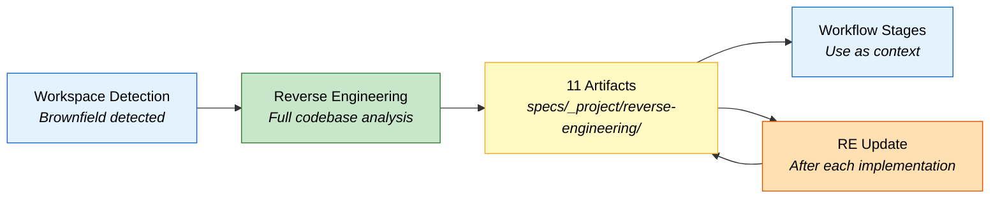

# Reverse Engineering

This document describes the reverse engineering process in Fluid Flow Pro -- what it does, when it runs, and the artifacts it generates in `specs/_project/reverse-engineering/`.

---

## Table of Contents

- [Overview](#overview)
- [When It Runs](#when-it-runs)
- [Discovery Process](#discovery-process)
- [Generated Artifacts](#generated-artifacts)
  - [1. business-overview.md](#1-business-overviewmd)
  - [2. architecture.md](#2-architecturemd)
  - [3. c4-architecture.md](#3-c4-architecturemd)
  - [4. code-structure.md](#4-code-structuremd)
  - [5. api-documentation.md](#5-api-documentationmd)
  - [6. component-inventory.md](#6-component-inventorymd)
  - [7. technology-stack.md](#7-technology-stackmd)
  - [8. dependencies.md](#8-dependenciesmd)
  - [9. code-quality-assessment.md](#9-code-quality-assessmentmd)
  - [10. test-coverage-analysis.md](#10-test-coverage-analysismd)
  - [11. reverse-engineering-timestamp.md](#11-reverse-engineering-timestampmd)
- [Incremental Updates](#incremental-updates)
- [Output Directory Structure](#output-directory-structure)

---

## Overview

Reverse engineering is a **run-once** analysis of an existing codebase. It produces 11 documentation artifacts that capture the project's business context, architecture, code structure, APIs, dependencies, quality, and test coverage. These artifacts serve as context for all subsequent workflow stages -- both Spec-Kit and AWS AI-DLC use them to make informed decisions about implementation.



---

## When It Runs

| Condition | Action |
|-----------|--------|
| **Greenfield project** (empty workspace) | Skipped entirely |
| **Brownfield project**, no RE artifacts | Runs full analysis |
| **Brownfield project**, RE artifacts exist | Skipped (uses existing artifacts) |

The run-once check looks for `specs/_project/reverse-engineering/reverse-engineering-timestamp.md`. If that file exists, the analysis has already been done.

After each implementation cycle, the **Reverse Engineering Update** stage incrementally updates the existing artifacts rather than regenerating them.

---

## Discovery Process

Before generating artifacts, the AI performs a multi-package discovery scan:

| Discovery Area | What Is Scanned |
|---------------|----------------|
| **Workspace Structure** | Root directory, all subdirectories, file counts by type |
| **Business Context** | System purpose, business transactions, domain terminology |
| **Infrastructure** | CDK, Terraform, CloudFormation, deployment scripts |
| **Build System** | Package managers (npm, Maven, Gradle, etc.), build configs |
| **Service Architecture** | Lambda functions, containers, APIs, data stores, message queues |
| **Code Quality** | Languages, frameworks, test coverage, linting configs, CI/CD pipelines |

All findings feed into the 11 artifacts below.

---

## Generated Artifacts

All artifacts are written to `specs/_project/reverse-engineering/`. User approval is required before the workflow proceeds.

---

### 1. business-overview.md

**Purpose**: Captures the business context -- what the system does from a business perspective, its transactions, and domain terminology.

**Sections**:

| Section | Content |
|---------|---------|
| Business Context Diagram | Mermaid diagram showing actors, systems, and interactions |
| Business Description | Overall system purpose and business transactions |
| Business Dictionary | Domain-specific terms and definitions |
| Component Business Descriptions | Per-package purpose and business responsibilities |

**Sample**:

```markdown
# Business Overview

## Business Context Diagram

​```mermaid
C4Context
    title Payment Processing Platform - Business Context

    Person(customer, "Customer", "Makes purchases via web or mobile")
    Person(merchant, "Merchant", "Receives payments and manages products")
    Person(admin, "Platform Admin", "Manages system configuration")

    System(platform, "Payment Platform", "Processes payments, manages accounts, handles disputes")

    System_Ext(bank, "Acquiring Bank", "Processes card transactions")
    System_Ext(fraud, "Fraud Detection Service", "Real-time fraud scoring")
    System_Ext(notif, "Notification Service", "Email and SMS delivery")

    Rel(customer, platform, "Submits payments")
    Rel(merchant, platform, "Views transactions, manages refunds")
    Rel(admin, platform, "Configures rules, monitors health")
    Rel(platform, bank, "Submits authorisation requests")
    Rel(platform, fraud, "Requests fraud scores")
    Rel(platform, notif, "Sends transaction notifications")
​```

## Business Description

The Payment Processing Platform handles end-to-end payment lifecycle management
for e-commerce merchants. Core business transactions include:

- **Payment Authorisation**: Customer initiates payment, platform validates,
  sends to acquiring bank, returns result
- **Settlement**: Batch processing of authorised transactions for merchant payout
- **Dispute Management**: Chargeback handling, evidence collection, resolution tracking

## Business Dictionary

| Term | Definition |
|------|-----------|
| Authorisation | Verification that funds are available and the transaction is legitimate |
| Settlement | Transfer of funds from acquiring bank to merchant account |
| Chargeback | Customer-initiated dispute reversing a completed transaction |
| PCI DSS | Payment Card Industry Data Security Standard |

## Component Business Descriptions

### payment-api
Handles inbound payment requests from merchant integrations. Validates request
format, applies business rules, and routes to the processing pipeline.

### settlement-engine
Runs nightly batch jobs to aggregate authorised transactions and submit
settlement files to the acquiring bank.
```

---

### 2. architecture.md

**Purpose**: Describes the system's overall architecture -- components, their relationships, data flows, and integration points.

**Sections**:

| Section | Content |
|---------|---------|
| System Overview | High-level description of the system |
| Architecture Diagram | Mermaid diagram of packages, services, data stores, and relationships |
| Component Descriptions | Per-component purpose, responsibilities, dependencies, and type |
| Data Flow | Mermaid sequence diagrams of main workflows |
| Integration Points | External APIs, databases, third-party services |
| Infrastructure Components | CDK stacks, deployment model, networking |

**Sample**:

```markdown
# Architecture

## System Overview

The platform follows a microservices architecture deployed on AWS. Services
communicate via API Gateway (synchronous) and SQS/EventBridge (asynchronous).

## Architecture Diagram

​```mermaid
flowchart TB
    subgraph API["API Layer"]
        GW["API Gateway"]
        AUTH["Authoriser Lambda"]
    end

    subgraph SERVICES["Service Layer"]
        PAY["Payment Service<br/><i>Lambda</i>"]
        SETTLE["Settlement Service<br/><i>ECS Fargate</i>"]
        DISPUTE["Dispute Service<br/><i>Lambda</i>"]
    end

    subgraph DATA["Data Layer"]
        DB[("Aurora PostgreSQL")]
        CACHE["ElastiCache Redis"]
        S3["S3<br/><i>Settlement Files</i>"]
    end

    subgraph ASYNC["Async Layer"]
        SQS["SQS Queues"]
        EB["EventBridge"]
    end

    GW --> AUTH --> PAY
    GW --> AUTH --> DISPUTE
    PAY --> DB
    PAY --> CACHE
    PAY --> SQS
    SQS --> SETTLE
    SETTLE --> DB
    SETTLE --> S3
    DISPUTE --> DB
    EB --> PAY
    EB --> DISPUTE

    style API fill:#E3F2FD,stroke:#1565C0,color:#000
    style SERVICES fill:#E8F5E9,stroke:#2E7D32,color:#000
    style DATA fill:#FFF9C4,stroke:#F9A825,color:#000
    style ASYNC fill:#FFE0B2,stroke:#E65100,color:#000
​```

## Data Flow

​```mermaid
sequenceDiagram
    participant Client
    participant Gateway as API Gateway
    participant Auth as Authoriser
    participant Pay as Payment Service
    participant DB as Aurora DB
    participant Bank as Acquiring Bank

    Client->>Gateway: POST /payments
    Gateway->>Auth: Validate token
    Auth-->>Gateway: Authorised
    Gateway->>Pay: Process payment
    Pay->>DB: Check idempotency key
    DB-->>Pay: Not found (new request)
    Pay->>Bank: Authorisation request
    Bank-->>Pay: Approved
    Pay->>DB: Store transaction
    Pay-->>Gateway: 201 Created
    Gateway-->>Client: Payment confirmed
​```

## Component Descriptions

| Component | Type | Purpose | Dependencies |
|-----------|------|---------|-------------|
| payment-api | Lambda | Processes payment requests | Aurora, Redis, SQS |
| settlement-engine | ECS Fargate | Nightly batch settlement | Aurora, S3 |
| dispute-service | Lambda | Handles chargebacks | Aurora, EventBridge |
| authoriser | Lambda | JWT token validation | Cognito |

## Integration Points

| External System | Protocol | Purpose |
|----------------|----------|---------|
| Acquiring Bank API | REST (HTTPS) | Card authorisation and settlement |
| Fraud Detection | gRPC | Real-time fraud scoring |
| SendGrid | REST | Transaction notification emails |
```

---

### 3. c4-architecture.md

**Purpose**: Provides a complete C4 model (Context, Container, Component, Code) of the system using Mermaid C4 syntax.

**Sections**:

| Level | Content |
|-------|---------|
| Level 1: System Context | Actors, the system boundary, external systems, and relationships |
| Level 2: Container | Deployable units (services, databases, queues), their technologies |
| Level 3: Component | Internal components within each non-trivial container |
| Level 4: Code | Class diagrams for 2--3 critical components |
| Supplementary Views | Optional dynamic and deployment diagrams |

**Sample**:

```markdown
# C4 Architecture

## Level 1: System Context

​```mermaid
C4Context
    title Payment Platform - System Context

    Person(customer, "Customer")
    Person(merchant, "Merchant")

    System(platform, "Payment Platform", "Processes payments and manages settlements")

    System_Ext(bank, "Acquiring Bank", "Card network processing")
    System_Ext(fraud, "Fraud Service", "Transaction scoring")

    Rel(customer, platform, "Makes payments")
    Rel(merchant, platform, "Manages transactions")
    Rel(platform, bank, "Submits authorisations")
    Rel(platform, fraud, "Requests fraud scores")
​```

## Level 2: Container

​```mermaid
C4Container
    title Payment Platform - Container Diagram

    Person(customer, "Customer")

    System_Boundary(platform, "Payment Platform") {
        Container(api, "API Gateway", "AWS API Gateway", "Routes and authorises requests")
        Container(pay, "Payment Service", "Node.js Lambda", "Processes payment transactions")
        Container(settle, "Settlement Engine", "Java ECS Fargate", "Batch settlement processing")
        ContainerDb(db, "Transaction DB", "Aurora PostgreSQL", "Stores all transaction data")
        ContainerDb(cache, "Cache", "ElastiCache Redis", "Session and idempotency cache")
        Container(queue, "Message Queue", "SQS", "Async task distribution")
    }

    Rel(customer, api, "HTTPS")
    Rel(api, pay, "Invoke")
    Rel(pay, db, "Read/Write")
    Rel(pay, cache, "Read/Write")
    Rel(pay, queue, "Publish")
    Rel(queue, settle, "Consume")
    Rel(settle, db, "Read/Write")
​```

## Level 3: Component (Payment Service)

​```mermaid
C4Component
    title Payment Service - Components

    Container_Boundary(pay, "Payment Service") {
        Component(handler, "Request Handler", "Lambda Handler", "Entry point, validation")
        Component(processor, "Payment Processor", "Core Logic", "Orchestrates payment flow")
        Component(bankClient, "Bank Client", "HTTP Client", "Communicates with acquiring bank")
        Component(repo, "Transaction Repository", "Data Access", "CRUD operations on transactions")
        Component(idempotency, "Idempotency Guard", "Cache Layer", "Prevents duplicate processing")
    }

    Rel(handler, processor, "Delegates to")
    Rel(processor, bankClient, "Calls")
    Rel(processor, repo, "Reads/Writes")
    Rel(processor, idempotency, "Checks")
​```

## Level 4: Code (Payment Processor)

​```mermaid
classDiagram
    class PaymentProcessor {
        -bankClient: BankClient
        -repository: TransactionRepository
        -idempotencyGuard: IdempotencyGuard
        +processPayment(request: PaymentRequest): PaymentResult
        -validateRequest(request: PaymentRequest): void
        -authorise(transaction: Transaction): AuthResult
        -persist(transaction: Transaction): void
    }

    class BankClient {
        +authorise(amount: Money, card: CardToken): AuthResponse
        +capture(authId: string): CaptureResponse
    }

    class TransactionRepository {
        +save(transaction: Transaction): void
        +findById(id: string): Transaction
        +findByIdempotencyKey(key: string): Transaction
    }

    PaymentProcessor --> BankClient
    PaymentProcessor --> TransactionRepository
    PaymentProcessor --> IdempotencyGuard
​```
```

---

### 4. code-structure.md

**Purpose**: Documents the build system, key classes/modules, file inventory, design patterns, and critical dependencies.

**Sections**:

| Section | Content |
|---------|---------|
| Build System | Type, configuration files, build commands |
| Key Classes/Modules | Mermaid class diagram or module hierarchy |
| Existing Files Inventory | Source files listed with their purpose |
| Design Patterns | Pattern name, location, purpose, and implementation notes |
| Critical Dependencies | Name, version, usage, and purpose |

**Sample**:

```markdown
# Code Structure

## Build System

| Property | Value |
|----------|-------|
| Type | npm (monorepo with workspaces) |
| Config | `package.json`, `tsconfig.json` |
| Build | `npm run build` (TypeScript compilation) |
| Test | `npm test` (Jest) |
| Lint | `npm run lint` (ESLint + Prettier) |

## Key Classes/Modules

​```mermaid
classDiagram
    class PaymentHandler {
        +handler(event, context)
    }
    class PaymentService {
        +processPayment(request)
        +refundPayment(transactionId)
    }
    class TransactionRepository {
        +save(transaction)
        +findById(id)
    }
    class BankGateway {
        +authorise(request)
        +capture(authId)
    }

    PaymentHandler --> PaymentService
    PaymentService --> TransactionRepository
    PaymentService --> BankGateway
​```

## Existing Files Inventory

| File | Purpose |
|------|---------|
| `src/handlers/payment-handler.ts` | Lambda entry point for payment requests |
| `src/services/payment-service.ts` | Core payment processing logic |
| `src/repositories/transaction-repo.ts` | Aurora database operations |
| `src/clients/bank-gateway.ts` | HTTP client for acquiring bank API |
| `src/models/transaction.ts` | Transaction entity definition |
| `src/middleware/auth.ts` | JWT validation middleware |
| `infra/lib/payment-stack.ts` | CDK stack for payment service |

## Design Patterns

| Pattern | Location | Purpose |
|---------|----------|---------|
| Repository | `src/repositories/` | Abstracts data access behind interfaces |
| Gateway | `src/clients/` | Encapsulates external service communication |
| Middleware Chain | `src/middleware/` | Request validation and auth pipeline |
| Factory | `src/models/` | Transaction creation with validation |

## Critical Dependencies

| Dependency | Version | Purpose |
|-----------|---------|---------|
| aws-sdk | 3.x | AWS service clients |
| pg | 8.x | PostgreSQL driver |
| jsonwebtoken | 9.x | JWT token handling |
| zod | 3.x | Request validation |
```

---

### 5. api-documentation.md

**Purpose**: Documents all REST APIs, internal interfaces, and data models.

**Sections**:

| Section | Content |
|---------|---------|
| REST APIs | Endpoint name, method, path, purpose, request/response schemas |
| Internal APIs | Interface/class name, methods, parameters, return types |
| Data Models | Model name, fields, types, relationships, validation rules |

**Sample**:

```markdown
# API Documentation

## REST APIs

### POST /payments

**Purpose**: Create a new payment transaction.

| Property | Value |
|----------|-------|
| Method | POST |
| Path | `/v1/payments` |
| Auth | Bearer token (JWT) |
| Rate Limit | 100 req/s per merchant |

**Request Body**:
​```json
{
  "amount": 4999,
  "currency": "EUR",
  "card_token": "tok_abc123",
  "merchant_id": "mch_xyz",
  "idempotency_key": "idem_001",
  "metadata": {
    "order_id": "order_456"
  }
}
​```

**Response (201)**:
​```json
{
  "id": "txn_789",
  "status": "authorised",
  "amount": 4999,
  "currency": "EUR",
  "created_at": "2026-02-09T14:30:00Z"
}
​```

### GET /payments/{id}

**Purpose**: Retrieve a payment transaction by ID.

| Property | Value |
|----------|-------|
| Method | GET |
| Path | `/v1/payments/{id}` |
| Auth | Bearer token (JWT) |

**Response (200)**:
​```json
{
  "id": "txn_789",
  "status": "authorised",
  "amount": 4999,
  "currency": "EUR",
  "merchant_id": "mch_xyz",
  "created_at": "2026-02-09T14:30:00Z",
  "updated_at": "2026-02-09T14:30:00Z"
}
​```

## Data Models

### Transaction

| Field | Type | Required | Description |
|-------|------|----------|-------------|
| id | string (UUID) | Yes | Unique transaction identifier |
| status | enum | Yes | authorised, captured, refunded, failed |
| amount | integer | Yes | Amount in minor units (cents) |
| currency | string (ISO 4217) | Yes | Three-letter currency code |
| merchant_id | string | Yes | Merchant account identifier |
| card_token | string | Yes | Tokenised card reference |
| idempotency_key | string | Yes | Client-provided deduplication key |
| created_at | datetime | Yes | ISO 8601 creation timestamp |
| updated_at | datetime | Yes | ISO 8601 last update timestamp |
```

---

### 6. component-inventory.md

**Purpose**: Catalogues every package/module in the workspace by category.

**Sections**:

| Section | Content |
|---------|---------|
| Application Packages | Package name and business purpose |
| Infrastructure Packages | Package name, IaC tool, purpose |
| Shared Packages | Package name, type (models/utils/clients), purpose |
| Test Packages | Package name, test type (unit/integration/load), purpose |
| Total Count | Summary counts by category |

**Sample**:

```markdown
# Component Inventory

## Application Packages

| Package | Purpose |
|---------|---------|
| payment-api | Payment processing Lambda functions |
| settlement-engine | Nightly batch settlement (ECS Fargate) |
| dispute-service | Chargeback handling Lambda functions |
| notification-worker | Transaction notification delivery |

## Infrastructure Packages

| Package | IaC Tool | Purpose |
|---------|----------|---------|
| infra-core | CDK (TypeScript) | VPC, networking, shared resources |
| infra-payment | CDK (TypeScript) | Payment service stack (Lambda, API GW) |
| infra-data | CDK (TypeScript) | Aurora, ElastiCache, S3 |

## Shared Packages

| Package | Type | Purpose |
|---------|------|---------|
| shared-models | Models | Transaction, merchant, and card type definitions |
| shared-utils | Utilities | Logging, error handling, date formatting |
| shared-clients | Clients | Bank API client, notification client |

## Test Packages

| Package | Type | Purpose |
|---------|------|---------|
| test-unit | Unit | Unit tests for all services |
| test-integration | Integration | API and database integration tests |
| test-load | Load | K6 load test scripts |

## Summary

| Category | Count |
|----------|-------|
| Application | 4 |
| Infrastructure | 3 |
| Shared | 3 |
| Test | 3 |
| **Total** | **13** |
```

---

### 7. technology-stack.md

**Purpose**: Documents all technologies, frameworks, and tools used in the project.

**Sections**:

| Section | Content |
|---------|---------|
| Programming Languages | Language, version, usage areas |
| Frameworks | Framework, version, purpose |
| Infrastructure | Cloud services, purpose |
| Build Tools | Tool, version, purpose |
| Testing Tools | Tool, version, purpose |

**Sample**:

```markdown
# Technology Stack

## Programming Languages

| Language | Version | Usage |
|----------|---------|-------|
| TypeScript | 5.3 | Application services, infrastructure (CDK) |
| Java | 17 | Settlement engine |
| SQL | N/A | Database migrations and queries |

## Frameworks

| Framework | Version | Purpose |
|-----------|---------|---------|
| AWS CDK | 2.x | Infrastructure as Code |
| Express.js | 4.x | Local development API server |
| Middy | 5.x | Lambda middleware framework |

## Infrastructure

| Service | Purpose |
|---------|---------|
| AWS Lambda | Serverless compute for payment and dispute services |
| ECS Fargate | Container hosting for settlement engine |
| Aurora PostgreSQL | Primary relational database |
| ElastiCache Redis | Caching and idempotency storage |
| API Gateway | REST API management and routing |
| SQS | Asynchronous message queuing |
| EventBridge | Event-driven integration |
| S3 | Settlement file storage |
| CloudWatch | Monitoring, logging, and alerting |

## Build Tools

| Tool | Version | Purpose |
|------|---------|---------|
| npm | 10.x | Package management (workspaces monorepo) |
| esbuild | 0.20.x | TypeScript bundling for Lambda |
| Maven | 3.9.x | Java build (settlement engine) |

## Testing Tools

| Tool | Version | Purpose |
|------|---------|---------|
| Jest | 29.x | Unit and integration testing (TypeScript) |
| JUnit | 5.x | Unit testing (Java) |
| K6 | 0.50.x | Load and performance testing |
| Testcontainers | 3.x | Local database integration testing |
```

---

### 8. dependencies.md

**Purpose**: Maps both internal (inter-package) and external (third-party) dependencies.

**Sections**:

| Section | Content |
|---------|---------|
| Internal Dependencies | Mermaid diagram of package relationships, with dependency type and reason |
| External Dependencies | Name, version, purpose, licence |

**Sample**:

```markdown
# Dependencies

## Internal Dependencies

​```mermaid
flowchart TD
    PAY["payment-api"] --> SM["shared-models"]
    PAY --> SU["shared-utils"]
    PAY --> SC["shared-clients"]
    SETTLE["settlement-engine"] --> SM
    SETTLE --> SU
    DISPUTE["dispute-service"] --> SM
    DISPUTE --> SU
    DISPUTE --> SC
    NOTIF["notification-worker"] --> SM
    NOTIF --> SU

    style PAY fill:#E8F5E9,stroke:#2E7D32,color:#000
    style SETTLE fill:#E8F5E9,stroke:#2E7D32,color:#000
    style DISPUTE fill:#E8F5E9,stroke:#2E7D32,color:#000
    style NOTIF fill:#E8F5E9,stroke:#2E7D32,color:#000
    style SM fill:#FFF9C4,stroke:#F9A825,color:#000
    style SU fill:#FFF9C4,stroke:#F9A825,color:#000
    style SC fill:#FFF9C4,stroke:#F9A825,color:#000
​```

| Source | Target | Type | Reason |
|--------|--------|------|--------|
| payment-api | shared-models | Compile | Transaction and card type definitions |
| payment-api | shared-utils | Compile | Logging and error handling |
| payment-api | shared-clients | Compile | Bank API client |
| settlement-engine | shared-models | Compile | Transaction models for batch processing |
| settlement-engine | shared-utils | Compile | Date formatting and logging |

## External Dependencies

| Dependency | Version | Purpose | Licence |
|-----------|---------|---------|---------|
| @aws-sdk/client-dynamodb | 3.x | DynamoDB operations | Apache 2.0 |
| pg | 8.x | PostgreSQL database driver | MIT |
| zod | 3.x | Request schema validation | MIT |
| jsonwebtoken | 9.x | JWT token verification | MIT |
| pino | 8.x | Structured JSON logging | MIT |
```

---

### 9. code-quality-assessment.md

**Purpose**: Assesses the current state of code quality, technical debt, and patterns.

**Sections**:

| Section | Content |
|---------|---------|
| Code Quality Indicators | Linting, code style, documentation, type safety |
| Technical Debt | Known issues, locations, and severity |
| Patterns and Anti-patterns | Good patterns in use, and anti-patterns to address |

**Sample**:

```markdown
# Code Quality Assessment

## Code Quality Indicators

| Indicator | Status | Details |
|-----------|--------|---------|
| Linting | Configured | ESLint with strict TypeScript rules |
| Code Style | Enforced | Prettier with consistent config across packages |
| Documentation | Partial | Public APIs documented; internal modules sparse |
| Type Safety | Strong | Strict TypeScript (`strict: true`), Zod for runtime validation |
| Error Handling | Consistent | Custom error classes with structured logging |

## Technical Debt

| Issue | Location | Severity | Notes |
|-------|----------|----------|-------|
| Legacy callback-style handlers | `src/handlers/legacy/` | Medium | 3 handlers not yet migrated to async/await |
| Hardcoded timeout values | `src/clients/bank-gateway.ts` | Low | Should be environment-configurable |
| Missing retry logic | `src/clients/notification-client.ts` | High | Notification failures are not retried |
| Unused dependencies | `package.json` | Low | 4 unused packages in root workspace |

## Patterns

### Good Patterns

| Pattern | Location | Notes |
|---------|----------|-------|
| Repository pattern | `src/repositories/` | Clean data access abstraction |
| Structured logging | All services | Consistent pino JSON logging |
| Input validation | `src/middleware/` | Zod schemas at API boundary |

### Anti-patterns

| Anti-pattern | Location | Impact |
|-------------|----------|--------|
| God function | `src/services/payment-service.ts:processPayment` | 200+ lines, handles too many concerns |
| Missing circuit breaker | `src/clients/` | External service failures cascade |
| Inline SQL | `src/repositories/transaction-repo.ts` | SQL strings mixed with logic |
```

---

### 10. test-coverage-analysis.md

**Purpose**: Establishes a baseline of test coverage metrics, pyramid health, gaps, and quality. This is used later for coverage delta comparisons after implementation.

**Sections**:

| Section | Content |
|---------|---------|
| Executive Summary | Overall coverage, critical risks, pyramid health, quality score |
| Current State Assessment | Layer-by-layer test counts and coverage |
| Coverage by Module | Per-module line, branch, and function coverage |
| Test Pyramid Distribution | Unit vs integration vs E2E vs contract counts and ideal ratios |
| Coverage Gap Analysis | Critical (P0), high (P1), and medium (P2) gaps |
| Business Flow Coverage | Coverage of critical business transactions |
| Test Quality Assessment | Quality score, anti-patterns, flaky and skipped tests |
| Complexity-Coverage Matrix | High-complexity functions vs their coverage |

**Sample**:

```markdown
# Test Coverage Analysis

## Executive Summary

| Metric | Value |
|--------|-------|
| Overall Line Coverage | 72% |
| Overall Branch Coverage | 58% |
| Critical Risk Areas | Bank integration, dispute resolution |
| Pyramid Health | Healthy (unit-heavy) |
| Test Quality Score | 7/10 |

## Current State Assessment

| Layer | Test Count | Coverage | Health | Notes |
|-------|-----------|----------|--------|-------|
| Unit | 186 | 78% | Good | Strong service layer coverage |
| Integration | 42 | 65% | Fair | Database tests solid, API tests sparse |
| Contract | 0 | 0% | Missing | No contract tests defined |
| E2E | 8 | 40% | Poor | Only happy-path scenarios |
| **Total** | **236** | **72%** | **Fair** | |

## Coverage Gap Analysis

### Critical (P0)

| File/Module | Current | Risk | Action |
|------------|---------|------|--------|
| bank-gateway.ts | 34% | High -- payment failures | Add error path and timeout tests |
| dispute-service.ts | 28% | High -- financial impact | Add chargeback workflow tests |

### High (P1)

| File/Module | Current | Risk | Action |
|------------|---------|------|--------|
| settlement-engine | 55% | Medium -- nightly batch | Add edge case and failure tests |
| auth middleware | 60% | Medium -- security | Add token expiry and role tests |

## Business Flow Coverage

| Critical Flow | Coverage | Weakest Link | Status |
|--------------|----------|-------------|--------|
| Payment authorisation | 75% | Bank response handling | Partial |
| Settlement processing | 55% | Error recovery | Weak |
| Dispute resolution | 28% | Full workflow | Critical gap |
| Refund processing | 70% | Partial refunds | Partial |
```

---

### 11. reverse-engineering-timestamp.md

**Purpose**: Metadata file that records when the analysis was performed, by whom, and what was generated. Also tracks subsequent incremental updates.

**Sections**:

| Section | Content |
|---------|---------|
| Initial Analysis Date | ISO 8601 timestamp of the original analysis |
| Last Updated | ISO 8601 timestamp of the most recent update |
| Analyzer | Tool identifier (`Fluid Flow - Reverse Engineering`) |
| Workspace | Workspace path that was analysed |
| Total Files Analyzed | Number of source files processed |
| Update History | Chronological list of incremental updates |
| Artifacts Generated | Checklist of all 11 artifacts |

**Sample**:

```markdown
# Reverse Engineering Metadata

| Field | Value |
|-------|-------|
| Initial Analysis Date | 2026-02-09T10:30:00Z |
| Last Updated | 2026-02-09T10:30:00Z |
| Analyzer | Fluid Flow - Reverse Engineering |
| Workspace | /Users/dev/projects/payment-platform |
| Total Files Analyzed | 147 |

## Update History

| Date | Feature | Changes |
|------|---------|---------|
| 2026-02-09T10:30:00Z | Initial analysis | Full codebase reverse engineering |

## Artifacts Generated

- [x] business-overview.md
- [x] architecture.md
- [x] c4-architecture.md
- [x] code-structure.md
- [x] api-documentation.md
- [x] component-inventory.md
- [x] technology-stack.md
- [x] dependencies.md
- [x] code-quality-assessment.md
- [x] test-coverage-analysis.md
- [x] reverse-engineering-timestamp.md
```

---

## Incremental Updates

After each implementation cycle (Spec-Kit `/speckit.implement` or AWS AI-DLC Build & Test), the **Reverse Engineering Update** stage incrementally updates the existing artifacts. This is not a full regeneration -- only the affected sections are modified.

| Principle | Description |
|-----------|-------------|
| **Incremental, not full** | Only update sections affected by the implementation |
| **Preserve existing content** | Do not remove or rewrite content that is still valid |
| **Additive by default** | New components, APIs, and patterns are added to existing lists |
| **Minimal structural changes** | Avoid reorganising artifact structure |
| **Traceable** | Every update is recorded in the timestamp file with feature reference |

### What Gets Updated

| Artifact | Typical Updates |
|----------|----------------|
| business-overview.md | New business transactions, updated component descriptions |
| architecture.md | New components, updated data flows, new integration points |
| c4-architecture.md | Updated diagrams at all affected C4 levels |
| code-structure.md | New files in inventory, new patterns, dependency changes |
| api-documentation.md | New or modified endpoints, new data models |
| component-inventory.md | New packages, updated counts |
| technology-stack.md | New languages/frameworks/tools, version bumps |
| dependencies.md | New or modified internal and external dependencies |
| code-quality-assessment.md | New patterns, anti-patterns, debt items |
| test-coverage-analysis.md | Updated metrics, pyramid, gaps, business flow coverage |
| reverse-engineering-timestamp.md | New entry in update history |

---

## Output Directory Structure

```
specs/
└── _project/
    └── reverse-engineering/
        ├── reverse-engineering-timestamp.md
        ├── business-overview.md
        ├── architecture.md
        ├── c4-architecture.md
        ├── code-structure.md
        ├── api-documentation.md
        ├── component-inventory.md
        ├── technology-stack.md
        ├── dependencies.md
        ├── code-quality-assessment.md
        └── test-coverage-analysis.md
```

This directory is shared across all features. Individual feature artifacts are stored in `specs/{BRANCH_NAME}/`, but reverse engineering artifacts are project-level and persist across all feature branches.
