# Fluid Flow AI v6 - Complete Workflow Flow Documentation

> **Purpose**: Comprehensive documentation of every step, action, command path, and memory file loaded across the full Fluid Flow AI lifecycle.

---

## Table of Contents

1. [Master Flow Diagram](#1-master-flow-diagram)
2. [Trigger & Gate (Pre-Workflow)](#2-trigger--gate-pre-workflow)
3. [Shared Entry Point - Stages 0-5](#3-shared-entry-point---stages-0-5)
   - [Stage 0: Shell Environment Detection](#stage-0-shell-environment-detection)
   - [Stage 1: Branch Creation](#stage-1-branch-creation)
   - [Stage 2: Workspace Detection](#stage-2-workspace-detection)
   - [Stage 3: Reverse Engineering (Conditional)](#stage-3-reverse-engineering-conditional)
   - [Stage 4: Workflow Selection](#stage-4-workflow-selection)
   - [Stage 5: Workflow Routing](#stage-5-workflow-routing)
4. [Fast-Track Workflow](#4-fast-track-workflow)
   - [Specify](#41-specify)
   - [Clarify (Optional)](#42-clarify-optional)
   - [Plan](#43-plan)
   - [Tasks](#44-tasks)
   - [Checklist (Optional)](#45-checklist-optional)
   - [Implement](#46-implement)
   - [VAPT (Mandatory)](#47-vapt-mandatory)
5. [Comprehensive Path Workflow](#5-aws-ai-dlc-workflow)
   - [Inception Phase](#51-inception-phase)
   - [Construction Phase](#52-construction-phase)
   - [Operations Phase (Placeholder)](#53-operations-phase-placeholder)
6. [Post-Implementation (Shared)](#6-post-implementation-shared)
   - [Update Docs](#61-update-docs)
   - [Retrospective](#62-retrospective)
7. [Shared Memory Files Reference](#7-shared-memory-files-reference)
8. [Analytics Tracking](#8-analytics-tracking)
9. [Directory Structure Reference](#9-directory-structure-reference)

---

## 1. Master Flow Diagram

```mermaid
%%{init: {'theme': 'base', 'themeVariables': {'primaryTextColor': '#1B2631', 'lineColor': '#546E7A', 'textColor': '#1B2631'}}}%%
flowchart TD
    UserRequest(["User Development Request"])

    subgraph TRIGGER["TRIGGER & GATE"]
        T1["Classify Request as Development"]
        T2["Display Workflow Gate Confirmation"]
        T3["Load fluid-flow.md Entry Point"]
        T4["Load Shared Memory Manifest"]
        T5["Display Welcome Message"]
        T1 --> T2 --> T3 --> T4 --> T5
    end

    subgraph ENTRY["SHARED ENTRY POINT"]
        S0["Stage 0: Shell Detection"]
        S1["Stage 1: Branch Creation"]
        S2["Stage 2: Workspace Detection"]
        S3{"Stage 3: Reverse Engineering<br/>(Brownfield + No Prior RE)"}
        S4["Stage 4: Workflow Selection"]
        S5["Stage 5: Workflow Routing"]
        S0 --> S1 --> S2 --> S3
        S3 -->|Execute| RE["Reverse Engineering"]
        S3 -->|Skip| S4
        RE --> S4 --> S5
    end

    subgraph FASTTRACK["FAST-TRACK WORKFLOW"]
        SK1["Specify"]
        SK2["Clarify (optional)"]
        SK3["Plan"]
        SK4["Tasks"]
        SK5["Checklist (optional)"]
        SK6["Implement"]
        SK7["VAPT"]
        SK1 --> SK2 --> SK3 --> SK4 --> SK5 --> SK6 --> SK7
    end

    subgraph COMPREHENSIVE["Comprehensive Path WORKFLOW"]
        direction TB
        subgraph INCEPTION["Inception Phase"]
            A1["Requirements Analysis"]
            A2["Onboarding Presentations (cond.)"]
            A3["User Stories (cond.)"]
            A3B["BDD Specification (cond.)"]
            A4["Workflow Planning"]
            A5["Application Design (cond.)"]
            A6["Units Generation (cond.)"]
        end
        subgraph CONSTRUCTION["Construction Phase (per-unit)"]
            C1["Functional Design (cond.)"]
            C2["NFR Requirements (cond.)"]
            C3["NFR Design (cond.)"]
            C4["Infrastructure Design (cond.)"]
            C5["Code Generation"]
            C6["Onboarding Update (cond.)"]
            C7["Build and Test"]
            C8["VAPT"]
            C9["Risk Report"]
        end
        A1 --> A2 --> A3 --> A3B --> A4 --> A5 --> A6
        A6 --> C1 --> C2 --> C3 --> C4 --> C5 --> C6
        C6 -->|Next Unit| C1
        C6 -->|All Units Done| C7
        C7 --> C8 --> C9
    end

    subgraph POST["POST-IMPLEMENTATION"]
        P1["Update Docs"]
        P2["Retrospective"]
        P1 --> P2
    end

    UserRequest --> T1
    T5 --> S0
    S5 -->|Fast-Track| SK1
    S5 -->|Comprehensive Path| A1
    SK7 --> P1
    C9 --> P1

    style TRIGGER fill:#CE93D8,stroke:#6A1B9A,stroke-width:2px
    style ENTRY fill:#64B5F6,stroke:#1565C0,stroke-width:2px
    style FASTTRACK fill:#81C784,stroke:#2E7D32,stroke-width:2px
    style COMPREHENSIVE fill:#FFB74D,stroke:#E65100,stroke-width:2px
    style INCEPTION fill:#FFB74D,stroke:#E65100,stroke-width:2px
    style CONSTRUCTION fill:#FFD54F,stroke:#F57F17,stroke-width:2px
    style POST fill:#4DB6AC,stroke:#00695C,stroke-width:2px
    style UserRequest fill:#CE93D8,stroke:#6A1B9A,stroke-width:3px
    style SK7 fill:#E57373,stroke:#B71C1C,stroke-width:2px
    style C8 fill:#E57373,stroke:#B71C1C,stroke-width:2px
    style C9 fill:#FFA726,stroke:#E65100,stroke-width:2px
    style A3B fill:#FFA726,stroke:#E65100,stroke-width:2px,stroke-dasharray: 5 5
```

---

## 2. Trigger & Gate (Pre-Workflow)

Every development request passes through the trigger gate defined in the Cursor workspace rule before any workflow logic begins.

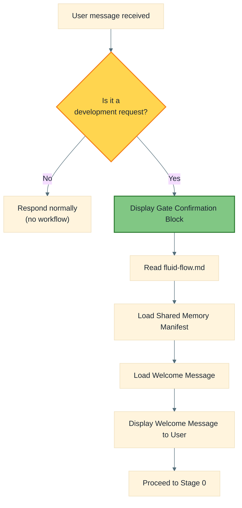

### Actions

| Step | Action | File Path / Command |
|------|--------|---------------------|
| 1 | Classify request | AI classifies from user message |
| 2 | Display gate confirmation | Output literal block to user |
| 3 | Load main workflow | **Read** `main-workflow/workflows/shared/commands/fluid-flow.md` |
| 4 | Load shared memory manifest | **Read** `main-workflow/workflows/shared/memory/load-shared-memory.md` |
| 5 | Display welcome message | **Read** `main-workflow/workflows/shared/memory/welcome-message.md` |

### Memory Files Loaded (via `load-shared-memory.md`)

| Memory File | Path (relative to `shared/memory/`) | Condition |
|-------------|--------------------------------------|-----------|
| AI Operating Contract | `ai-operating-contract.md` | Always |
| Content Validation | `content-validation.md` | Always |
| AI Self-Review | `review/ai-self-review.md` | Always |
| Human Gate | `review/human-gate.md` | Always |
| ISO 9001 Quality Mgmt | `iso/iso9001-quality-management.md` | Always |
| ADR Integrity Gate | `architecture/adr-integrity-gate.md` | Always |
| Continuous Learning | `meta/continuous-learning.md` | Always |
| Overconfidence Prevention | `overconfidence-prevention.md` | Always |
| Presentations Guidelines | `presentations/general.md` | Always |
| ISO 27001 Compliance | `security/iso27001/compliance.md` | Security/data/identity/infra changes |
| All security rules | `security/*.md` (10 files) | Security/data/identity/infra changes |
| ISO 50001 Energy Mgmt | `iso/iso50001-energy-management.md` | Infra/performance/energy changes |

---

## 3. Shared Entry Point - Stages 0-5

All development features share stages 0 through 5 before diverging into a workflow-specific path.

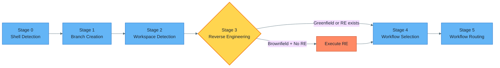

---

### Stage 0: Shell Environment Detection

**Purpose**: Detect Bash vs PowerShell to invoke correct automation scripts throughout.

**Reference file**: `main-workflow/workflows/shared/stages/shell-detection.md`

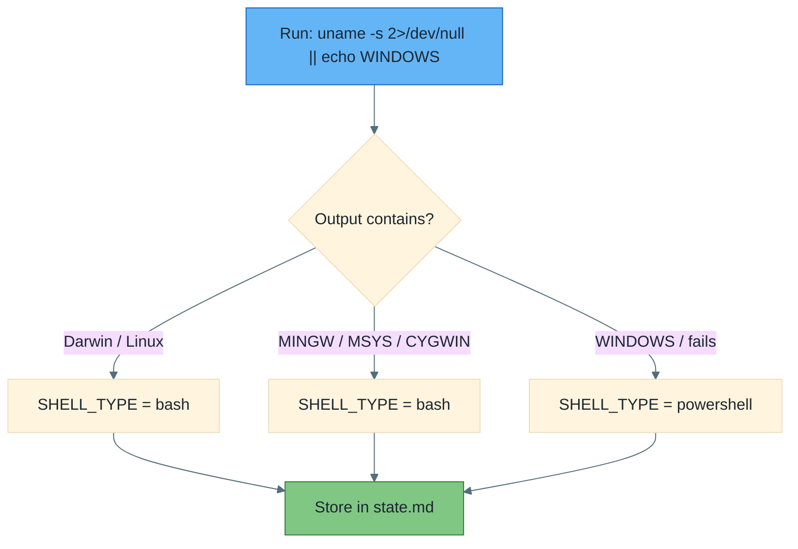

| Action | Detail |
|--------|--------|
| Run detection command | `uname -s 2>/dev/null \|\| echo "WINDOWS"` |
| Store result | `specs/{BRANCH_NAME}/state.md` under `**Shell**` field |
| Reference file loaded | `main-workflow/workflows/shared/stages/shell-detection.md` |

---

### Stage 1: Branch Creation

**Purpose**: Create a feature branch, initialize feature directory, state file, audit file, and analytics file.

**Reference file**: `main-workflow/workflows/shared/commands/fluid-flow.md` (Stage 1 section)

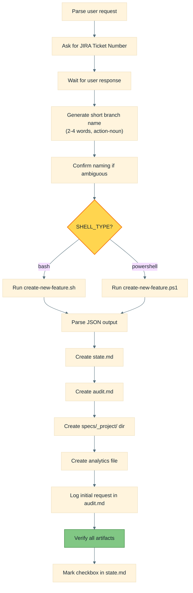

| Action | File Path / Command |
|--------|---------------------|
| Create feature (bash) | `main-workflow/workflows/fast-track/scripts/bash/create-new-feature.sh --json --short-name "<name>" [--jira-ticket "<ticket>"] "<description>"` |
| Create feature (PS) | `main-workflow/workflows/fast-track/scripts/powershell/create-new-feature.ps1 -Json -ShortName "<name>" [-JiraTicket "<ticket>"] "<description>"` |
| Create state file | `specs/{BRANCH_NAME}/state.md` |
| Create audit file | `specs/{BRANCH_NAME}/audit.md` |
| Create project dir | `specs/_project/` |
| Create analytics file | `main-workflow/analytics/{BRANCH_NAME}.md` |

**Artifacts verified**:

| Artifact | Path |
|----------|------|
| Feature directory | `specs/{BRANCH_NAME}/` |
| State file | `specs/{BRANCH_NAME}/state.md` |
| Audit file | `specs/{BRANCH_NAME}/audit.md` |
| Project directory | `specs/_project/` |
| Analytics file | `main-workflow/analytics/{BRANCH_NAME}.md` |

---

### Stage 2: Workspace Detection

**Purpose**: Scan workspace to determine Greenfield vs Brownfield, check for existing RE artifacts.

**Reference file**: `main-workflow/workflows/shared/stages/workspace-detection.md`

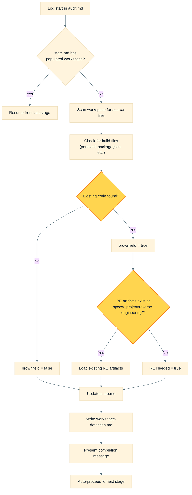

| Action | File Path |
|--------|-----------|
| Stage instructions loaded | `main-workflow/workflows/shared/stages/workspace-detection.md` |
| State updated | `specs/{BRANCH_NAME}/state.md` |
| Artifact created | `specs/{BRANCH_NAME}/workspace-detection.md` |
| RE timestamp checked | `specs/_project/reverse-engineering/reverse-engineering-timestamp.md` |

---

### Stage 3: Reverse Engineering (Conditional)

**Execute IF**: Brownfield + no prior RE artifacts  
**Skip IF**: Greenfield OR RE artifacts already exist

**Reference file**: `main-workflow/workflows/shared/stages/reverse-engineering.md`

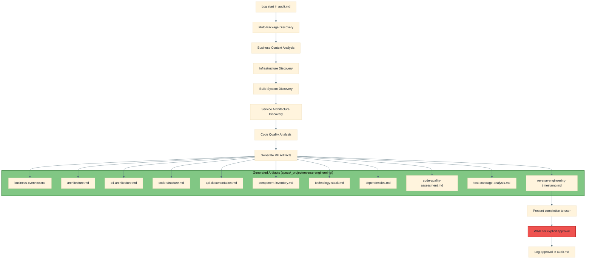

| Action | File Path |
|--------|-----------|
| Stage instructions | `main-workflow/workflows/shared/stages/reverse-engineering.md` |
| Test coverage analysis instructions | `main-workflow/workflows/shared/stages/test-coverage-analysis.md` (Phase 1) |
| All outputs written to | `specs/_project/reverse-engineering/*.md` (11 files) |

---

### Stage 4: Workflow Selection

**Purpose**: User chooses between Fast-Track and Comprehensive Path.

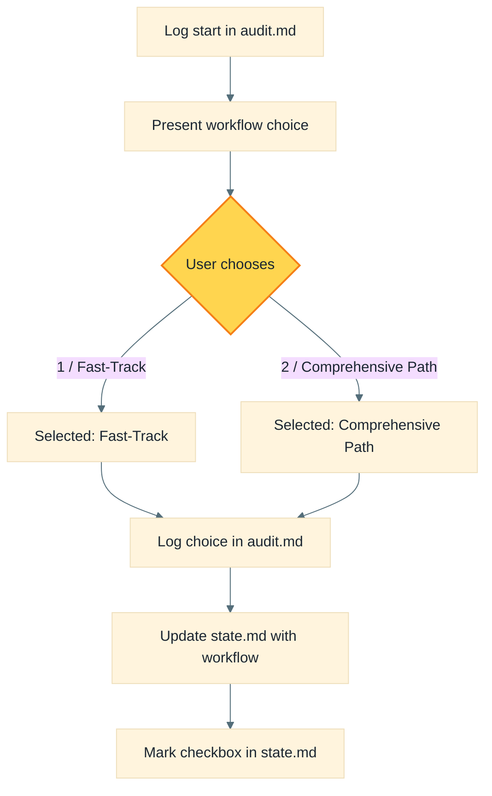

| Action | File Path |
|--------|-----------|
| State updated | `specs/{BRANCH_NAME}/state.md` (Workflow field) |
| Choice logged | `specs/{BRANCH_NAME}/audit.md` |

---

### Stage 5: Workflow Routing

**Purpose**: Initialize the chosen workflow's analytics rows and begin execution.

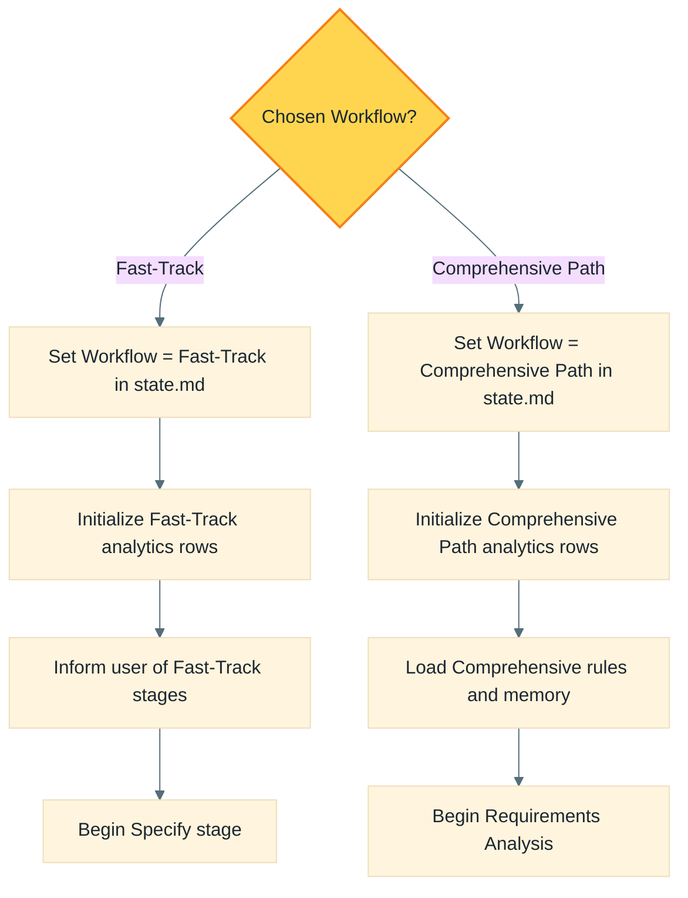

| Action | File Path |
|--------|-----------|
| Analytics updated | `main-workflow/analytics/{BRANCH_NAME}.md` |
| Fast-Track first command loaded | `main-workflow/workflows/fast-track/commands/fasttrack.specify.md` |
| Comprehensive rules loaded | `main-workflow/workflows/comprehensive/commands/comprehensive-rules.md` |
| Comprehensive memory manifest loaded | `main-workflow/workflows/comprehensive/memory/load-comprehensive-memory.md` |

---

## 4. Fast-Track Workflow

The Fast-Track workflow is a lightweight specification-to-implementation pipeline with 6 stages.

```mermaid
%%{init: {'theme': 'base', 'themeVariables': {'primaryTextColor': '#1B2631', 'lineColor': '#546E7A', 'textColor': '#1B2631'}}}%%
flowchart LR
    SK1["Specify"] --> SK2["Clarify<br/>(optional)"]
    SK2 --> SK3["Plan"]
    SK3 --> SK4["Tasks"]
    SK4 --> SK5["Checklist<br/>(optional)"]
    SK5 --> SK6["Implement"]
    SK6 --> SK7["VAPT"]
    SK7 --> POST["Post-Implementation"]

    style SK1 fill:#66BB6A,stroke:#1B5E20,stroke-width:2px
    style SK2 fill:#FFA726,stroke:#E65100,stroke-width:2px,stroke-dasharray: 5 5
    style SK3 fill:#66BB6A,stroke:#1B5E20,stroke-width:2px
    style SK4 fill:#66BB6A,stroke:#1B5E20,stroke-width:2px
    style SK5 fill:#FFA726,stroke:#E65100,stroke-width:2px,stroke-dasharray: 5 5
    style SK6 fill:#66BB6A,stroke:#1B5E20,stroke-width:2px
    style SK7 fill:#E57373,stroke:#B71C1C,stroke-width:2px
    style POST fill:#4DB6AC,stroke:#00695C,stroke-width:2px
```

---

### 4.1 Specify

**Command file**: `main-workflow/workflows/fast-track/commands/fasttrack.specify.md`

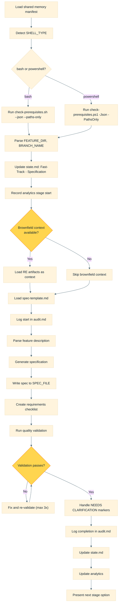

| Action | File Path / Command |
|--------|---------------------|
| Command loaded | `main-workflow/workflows/fast-track/commands/fasttrack.specify.md` |
| Memory loaded | `main-workflow/workflows/shared/memory/load-shared-memory.md` (+ all listed files) |
| Prerequisites (bash) | `main-workflow/workflows/fast-track/scripts/bash/check-prerequisites.sh --json --paths-only` |
| Prerequisites (PS) | `main-workflow/workflows/fast-track/scripts/powershell/check-prerequisites.ps1 -Json -PathsOnly` |
| Spec template loaded | `main-workflow/workflows/fast-track/templates/spec-template.md` |
| RE artifacts loaded (if brownfield) | `specs/_project/reverse-engineering/{business-overview,architecture,code-structure,api-documentation,component-inventory}.md` |
| Analytics step update | `main-workflow/workflows/shared/stages/analytics-step-update.md` |
| Analytics update | `main-workflow/workflows/shared/stages/analytics-update.md` (Step 3) |
| Spec written to | `specs/{BRANCH_NAME}/spec.md` |
| Checklist written to | `specs/{BRANCH_NAME}/checklists/requirements.md` |

---

### 4.2 Clarify (Optional)

**Command file**: `main-workflow/workflows/fast-track/commands/fasttrack.clarify.md`

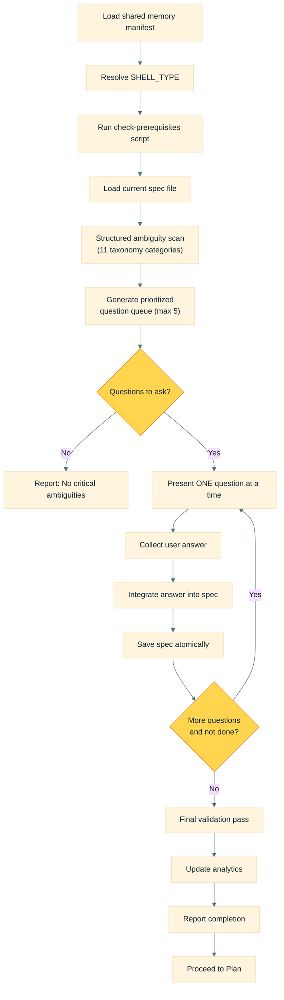

| Action | File Path |
|--------|-----------|
| Command loaded | `main-workflow/workflows/fast-track/commands/fasttrack.clarify.md` |
| Spec read/updated | `specs/{BRANCH_NAME}/spec.md` |
| Analytics updated | `main-workflow/analytics/{BRANCH_NAME}.md` (Stage: Clarify) |

**Taxonomy categories scanned**: Functional Scope, Domain & Data Model, Interaction & UX Flow, Non-Functional Quality, Integration & External Dependencies, Edge Cases & Failure Handling, Constraints & Tradeoffs, Terminology & Consistency, Completion Signals, Misc/Placeholders.

---

### 4.3 Plan

**Command file**: `main-workflow/workflows/fast-track/commands/fasttrack.plan.md`

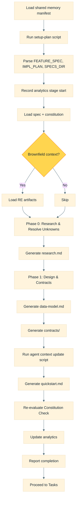

| Action | File Path / Command |
|--------|---------------------|
| Command loaded | `main-workflow/workflows/fast-track/commands/fasttrack.plan.md` |
| Setup plan (bash) | `main-workflow/workflows/fast-track/scripts/bash/setup-plan.sh --json` |
| Setup plan (PS) | `main-workflow/workflows/fast-track/scripts/powershell/setup-plan.ps1 -Json` |
| Constitution loaded | `main-workflow/workflows/fast-track/memory/constitution.md` |
| Agent context (bash) | `main-workflow/workflows/fast-track/scripts/bash/update-agent-context.sh <agent-type>` |
| Agent context (PS) | `main-workflow/workflows/fast-track/scripts/powershell/update-agent-context.ps1 -AgentType <agent-type>` |
| Outputs | `specs/{BRANCH_NAME}/{research.md, data-model.md, contracts/*, quickstart.md, plan.md}` |

---

### 4.4 Tasks

**Command file**: `main-workflow/workflows/fast-track/commands/fasttrack.tasks.md`

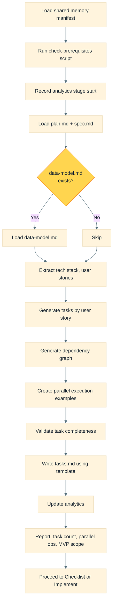

| Action | File Path |
|--------|-----------|
| Command loaded | `main-workflow/workflows/fast-track/commands/fasttrack.tasks.md` |
| Tasks template | `main-workflow/workflows/fast-track/templates/tasks-template.md` |
| Output | `specs/{BRANCH_NAME}/tasks.md` |

**Task format**: `- [ ] [TaskID] [P?] [Story?] Description with file path`

**Phase structure**: Setup -> Foundational -> User Stories (P1, P2...) -> Polish

---

### 4.5 Checklist (Optional)

**Command file**: `main-workflow/workflows/fast-track/commands/fasttrack.checklist.md`

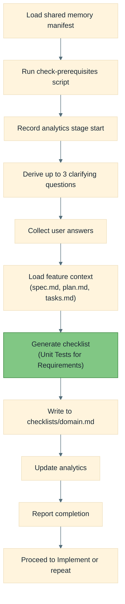

| Action | File Path |
|--------|-----------|
| Command loaded | `main-workflow/workflows/fast-track/commands/fasttrack.checklist.md` |
| Checklist template | `main-workflow/workflows/fast-track/templates/checklist-template.md` |
| Output | `specs/{BRANCH_NAME}/checklists/{domain}.md` (e.g., `ux.md`, `security.md`) |

---

### 4.6 Implement

**Command file**: `main-workflow/workflows/fast-track/commands/fasttrack.implement.md`

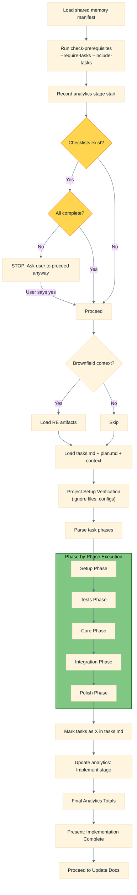

| Action | File Path / Command |
|--------|---------------------|
| Command loaded | `main-workflow/workflows/fast-track/commands/fasttrack.implement.md` |
| Prerequisites (bash) | `main-workflow/workflows/fast-track/scripts/bash/check-prerequisites.sh --json --require-tasks --include-tasks` |
| Analytics final totals | `main-workflow/workflows/shared/stages/analytics-update.md` (Step 3 per phase + Step 4 final) |
| Post-impl docs command | `main-workflow/workflows/shared/commands/fluid-flow.update-docs.md` |

**Per-phase analytics stage names**: `Implement - Setup`, `Implement - Tests`, `Implement - Core`, `Implement - Integration`, `Implement - Polish`, `Implement` (overall).

---

### 4.7 VAPT (Mandatory)

**Stage file**: `main-workflow/workflows/shared/stages/vapt.md`

**Purpose**: Perform a structured, AI-assisted security assessment of all generated code and infrastructure before proceeding to documentation updates. Always executes after Implement, with depth scaling by risk.

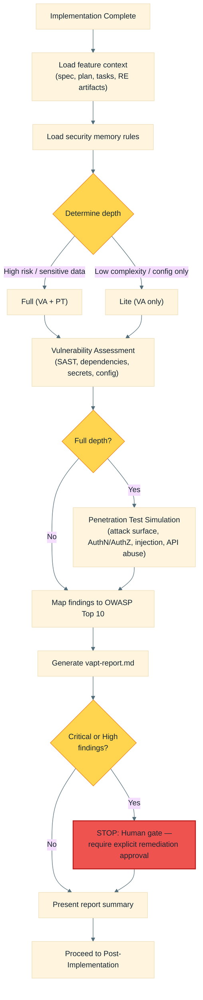

| Action | File Path |
|--------|-----------|
| Stage instructions | `main-workflow/workflows/shared/stages/vapt.md` |
| Report template | `main-workflow/workflows/shared/memory/security/vapt-report-template.md` |
| Report output | `specs/{BRANCH_NAME}/security/vapt-report.md` |

**Depth determination signals**:

| Signal | VAPT Depth |
|--------|------------|
| Complexity = High, new auth/authz logic, external APIs, sensitive/PII data, infra changes | Full (VA + PT) |
| Low-complexity UI or config-only change | Lite (VA only) |

**VA checks**: SAST (injection, deserialisation, crypto, randomness, path traversal, XXE, open redirects, info disclosure), dependency scanning, secret scanning, configuration review, data classification validation.

**PT checks** (Full only): Attack surface mapping, authentication bypass, authorisation escalation, injection simulation, API abuse, infrastructure attack simulation.

---

## 5. Comprehensive Path Workflow

The Comprehensive Path workflow is a comprehensive enterprise SDLC with three phases.

```mermaid
%%{init: {'theme': 'base', 'themeVariables': {'primaryTextColor': '#1B2631', 'lineColor': '#546E7A', 'textColor': '#1B2631'}}}%%
flowchart TD
    subgraph INCEPTION["INCEPTION PHASE - What and Why"]
        RA["Requirements Analysis<br/><b>ALWAYS</b>"]
        OP["Onboarding Presentations<br/><b>CONDITIONAL</b>"]
        US["User Stories<br/><b>CONDITIONAL</b>"]
        BDD["BDD Specification<br/><b>CONDITIONAL</b>"]
        WP["Workflow Planning<br/><b>ALWAYS</b>"]
        AD["Application Design<br/><b>CONDITIONAL</b>"]
        UG["Units Generation<br/><b>CONDITIONAL</b>"]
        RA --> OP --> US --> BDD --> WP --> AD --> UG
    end

    subgraph CONSTRUCTION["CONSTRUCTION PHASE - How to Build"]
        subgraph UNIT_LOOP["Per-Unit Loop"]
            FD["Functional Design<br/><b>CONDITIONAL</b>"]
            NR["NFR Requirements<br/><b>CONDITIONAL</b>"]
            ND["NFR Design<br/><b>CONDITIONAL</b>"]
            ID["Infrastructure Design<br/><b>CONDITIONAL</b>"]
            CG["Code Generation<br/><b>ALWAYS</b>"]
            OU["Onboarding Update<br/><b>CONDITIONAL</b>"]
            FD --> NR --> ND --> ID --> CG --> OU
        end
        BT["Build and Test<br/><b>ALWAYS</b>"]
        VAPT["VAPT<br/><b>ALWAYS</b>"]
        RR["Risk Report<br/><b>ALWAYS</b>"]
        OU -->|Next Unit| FD
        OU -->|All Done| BT
        BT --> VAPT --> RR
    end

    subgraph OPERATIONS["OPERATIONS PHASE - Placeholder"]
        OPS["Operations<br/>(Future)"]
    end

    UG --> FD
    RR --> OPS

    style INCEPTION fill:#64B5F6,stroke:#1565C0,stroke-width:2px
    style CONSTRUCTION fill:#81C784,stroke:#2E7D32,stroke-width:2px
    style OPERATIONS fill:#FFD54F,stroke:#F57F17,stroke-width:2px
    style UNIT_LOOP fill:#81C784,stroke:#2E7D32,stroke-width:2px
    style RA fill:#66BB6A,stroke:#1B5E20,stroke-width:3px
    style WP fill:#66BB6A,stroke:#1B5E20,stroke-width:3px
    style CG fill:#66BB6A,stroke:#1B5E20,stroke-width:3px
    style BT fill:#66BB6A,stroke:#1B5E20,stroke-width:3px
    style VAPT fill:#E57373,stroke:#B71C1C,stroke-width:2px
    style RR fill:#FFA726,stroke:#E65100,stroke-width:2px
    style OP fill:#FFA726,stroke:#E65100,stroke-width:2px,stroke-dasharray: 5 5
    style US fill:#FFA726,stroke:#E65100,stroke-width:2px,stroke-dasharray: 5 5
    style BDD fill:#FFA726,stroke:#E65100,stroke-width:2px,stroke-dasharray: 5 5
    style AD fill:#FFA726,stroke:#E65100,stroke-width:2px,stroke-dasharray: 5 5
    style UG fill:#FFA726,stroke:#E65100,stroke-width:2px,stroke-dasharray: 5 5
    style FD fill:#FFA726,stroke:#E65100,stroke-width:2px,stroke-dasharray: 5 5
    style NR fill:#FFA726,stroke:#E65100,stroke-width:2px,stroke-dasharray: 5 5
    style ND fill:#FFA726,stroke:#E65100,stroke-width:2px,stroke-dasharray: 5 5
    style ID fill:#FFA726,stroke:#E65100,stroke-width:2px,stroke-dasharray: 5 5
    style OU fill:#FFA726,stroke:#E65100,stroke-width:2px,stroke-dasharray: 5 5
    style OPS fill:#9E9E9E,stroke:#424242,stroke-width:2px,stroke-dasharray: 5 5
```

### Comprehensive-Specific Memory Files Loaded (via `load-comprehensive-memory.md`)

| Memory File | Path (relative to `comprehensive/memory/`) |
|-------------|----------------------------------|
| Process Overview | `common/process-overview.md` |
| Session Continuity | `common/session-continuity.md` |
| Question Format Guide | `common/question-format-guide.md` |
| Depth Levels | `common/depth-levels.md` |
| Error Handling | `common/error-handling.md` |
| Terminology | `common/terminology.md` |
| Workflow Changes | `common/workflow-changes.md` |

### Comprehensive Additional Mandatory Loads

| File | Path | Condition |
|------|------|-----------|
| Comprehensive Rules (main command) | `main-workflow/workflows/comprehensive/commands/comprehensive-rules.md` | Always |
| ADRs & Technical Principles | `main-workflow/workflows/comprehensive/inception/adrs-technical-principles.md` | Always |
| C# Guidelines | `main-workflow/Instructions/technology/csharp/general.md` | Always |
| .NET Guidelines | `main-workflow/Instructions/technology/dotnet/general.md` | Always |
| Terraform Guidelines | `main-workflow/Instructions/technology/terraform/general.md` | Always |
| Coralogix Observability | `main-workflow/Instructions/technology/coralogix/general.md` | Project uses Coralogix |

---

### 5.1 Inception Phase

#### Requirements Analysis (ALWAYS - Adaptive Depth)

**Instruction file**: `main-workflow/workflows/comprehensive/inception/requirements-analysis.md`

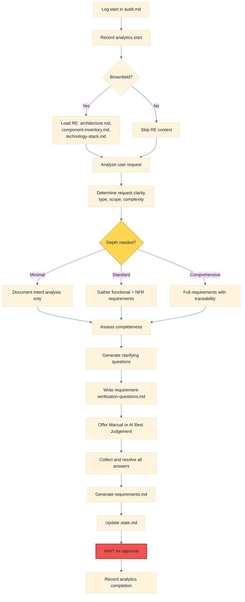

| Action | File Path |
|--------|-----------|
| Instruction loaded | `main-workflow/workflows/comprehensive/inception/requirements-analysis.md` |
| Questions written to | `specs/{BRANCH_NAME}/inception/requirements/requirement-verification-questions.md` |
| Requirements written to | `specs/{BRANCH_NAME}/inception/requirements/requirements.md` |

#### Onboarding Presentations (CONDITIONAL)

**Instruction file**: `main-workflow/workflows/comprehensive/inception/onboarding-presentations.md`

| Action | File Path |
|--------|-----------|
| Engineer deck | `specs/{BRANCH_NAME}/inception/onboarding/engineers/onboarding-engineers.md` |
| Product deck | `specs/{BRANCH_NAME}/inception/onboarding/product/onboarding-product.md` |
| Feature registry | `specs/{BRANCH_NAME}/features/features-registry.md` |
| RE artifacts loaded | `specs/_project/reverse-engineering/*.md` |

#### User Stories (CONDITIONAL)

**Instruction file**: `main-workflow/workflows/comprehensive/inception/user-stories.md`

Two-part stage: **Part 1 - Planning** (create plan, collect answers, resolve ambiguities) then **Part 2 - Generation** (execute plan, generate stories).

| Action | File Path |
|--------|-----------|
| Assessment doc | `specs/{BRANCH_NAME}/inception/plans/user-stories-assessment.md` |
| Story plan | `specs/{BRANCH_NAME}/inception/plans/story-generation-plan.md` |
| Stories output | `specs/{BRANCH_NAME}/inception/user-stories/stories.md` |
| Personas output | `specs/{BRANCH_NAME}/inception/user-stories/personas.md` |

#### BDD Specification (CONDITIONAL)

**Instruction file**: `main-workflow/workflows/comprehensive/inception/bdd-specification.md`

**Purpose**: Convert user stories and acceptance criteria into living Gherkin specifications that bridge business requirements and technical tests.

**Execute IF**: User stories exist with acceptance criteria, complex business rules with multiple scenario paths, external stakeholder validation required, regulated/compliance scenarios, or cross-team collaboration needs.

**Skip IF**: Pure infrastructure changes, zero-behaviour refactoring, trivial CRUD with no business rules, or developer tooling changes.

Two-part stage: **Part 1 - Planning** (assess BDD need, establish domain language, ask clarifying questions, get approval) then **Part 2 - Generation** (execute plan, generate Gherkin feature files and strategy artifacts).

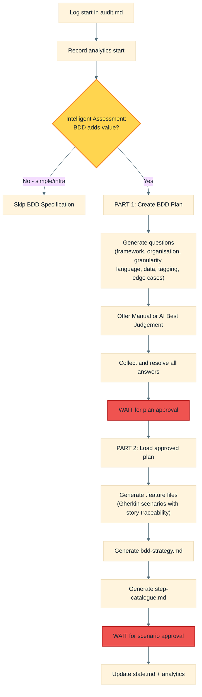

| Action | File Path |
|--------|-----------|
| Instruction loaded | `main-workflow/workflows/comprehensive/inception/bdd-specification.md` |
| Assessment output | `specs/{BRANCH_NAME}/inception/plans/bdd-specification-assessment.md` |
| BDD plan | `specs/{BRANCH_NAME}/inception/plans/bdd-specification-plan.md` |
| Feature files | `specs/{BRANCH_NAME}/inception/bdd/features/*.feature` |
| BDD strategy | `specs/{BRANCH_NAME}/inception/bdd/bdd-strategy.md` |
| Step catalogue | `specs/{BRANCH_NAME}/inception/bdd/step-catalogue.md` |

**Construction phase integration**: When BDD Specification is executed, downstream stages reference the BDD artifacts:
- **Functional Design** loads BDD scenarios to map Gherkin steps to domain entities and business rules, producing `bdd-step-mapping.md`
- **Code Generation** generates step definition classes from the step mapping, placing them in the project's test structure

---

#### Workflow Planning (ALWAYS)

**Instruction file**: `main-workflow/workflows/comprehensive/inception/workflow-planning.md`

```mermaid
%%{init: {'theme': 'base', 'themeVariables': {'primaryTextColor': '#1B2631', 'lineColor': '#546E7A', 'textColor': '#1B2631'}}}%%
flowchart TD
    A["Load all prior context"] --> B["Detailed scope analysis"]
    B --> C{"Brownfield?"}
    C -->|Yes| D["Transformation scope detection"]
    C -->|No| E["Skip transformation analysis"]
    D --> F["Change impact assessment"]
    E --> F
    F --> G["Component relationship mapping"]
    G --> H["Risk assessment"]
    H --> I["Phase determination<br/>(execute vs skip each stage)"]
    I --> J["Multi-module coordination (if needed)"]
    J --> K["Generate workflow visualization<br/>(Mermaid)"]
    K --> L["Create execution-plan.md"]
    L --> M["Initialize state tracking"]
    M --> N["WAIT for approval"]

    style C fill:#FFD54F,stroke:#F57F17
    style N fill:#EF5350,stroke:#B71C1C,stroke-width:2px
```

| Action | File Path |
|--------|-----------|
| Execution plan | `specs/{BRANCH_NAME}/inception/plans/execution-plan.md` |
| Context loaded | Requirements, user stories, RE artifacts |

#### Application Design (CONDITIONAL)

**Instruction file**: `main-workflow/workflows/comprehensive/inception/application-design.md`

| Action | File Path |
|--------|-----------|
| Plan | `specs/{BRANCH_NAME}/inception/plans/application-design-plan.md` |
| Components | `specs/{BRANCH_NAME}/inception/application-design/components.md` |
| Component Methods | `specs/{BRANCH_NAME}/inception/application-design/component-methods.md` |
| Services | `specs/{BRANCH_NAME}/inception/application-design/services.md` |
| Dependencies | `specs/{BRANCH_NAME}/inception/application-design/component-dependency.md` |

#### Units Generation (CONDITIONAL)

**Instruction file**: `main-workflow/workflows/comprehensive/inception/units-generation.md`

Two-part stage: **Part 1 - Planning** then **Part 2 - Generation**.

| Action | File Path |
|--------|-----------|
| Unit plan | `specs/{BRANCH_NAME}/inception/plans/unit-of-work-plan.md` |
| Unit definitions | `specs/{BRANCH_NAME}/inception/application-design/unit-of-work.md` |
| Unit dependencies | `specs/{BRANCH_NAME}/inception/application-design/unit-of-work-dependency.md` |
| Story map | `specs/{BRANCH_NAME}/inception/application-design/unit-of-work-story-map.md` |

---

### 5.2 Construction Phase

The construction phase loops through each unit of work, executing conditional design stages followed by code generation. After all units complete, Build and Test runs.

```mermaid
%%{init: {'theme': 'base', 'themeVariables': {'primaryTextColor': '#1B2631', 'lineColor': '#546E7A', 'textColor': '#1B2631'}}}%%
flowchart TD
    START["Start Construction Phase"] --> UNIT{"For each unit"}
    UNIT --> FD{"Functional Design<br/>needed?"}
    FD -->|Yes| FD_EXEC["Execute Functional Design"]
    FD -->|No| NR
    FD_EXEC --> NR{"NFR Requirements<br/>needed?"}
    NR -->|Yes| NR_EXEC["Execute NFR Requirements"]
    NR -->|No| ND
    NR_EXEC --> ND{"NFR Design<br/>needed?"}
    ND -->|Yes| ND_EXEC["Execute NFR Design"]
    ND -->|No| ID
    ND_EXEC --> ID{"Infrastructure Design<br/>needed?"}
    ID -->|Yes| ID_EXEC["Execute Infrastructure Design"]
    ID -->|No| CG
    ID_EXEC --> CG["Code Generation<br/>(Part 1: Plan + Part 2: Generate)"]
    CG --> OU{"Onboarding Update<br/>needed?"}
    OU -->|Yes| OU_EXEC["Execute Onboarding Update"]
    OU -->|No| NEXT
    OU_EXEC --> NEXT{"More units?"}
    NEXT -->|Yes| UNIT
    NEXT -->|No| BT["Build and Test"]
    BT --> VAPT["VAPT"]
    VAPT --> RR["Risk Report"]
    RR --> RE_UPDATE{"RE artifacts exist?"}
    RE_UPDATE -->|Yes| RE["Reverse Engineering Update"]
    RE_UPDATE -->|No| DONE["Construction Complete"]
    RE --> DONE

    style FD fill:#FFD54F,stroke:#F57F17
    style NR fill:#FFD54F,stroke:#F57F17
    style ND fill:#FFD54F,stroke:#F57F17
    style ID fill:#FFD54F,stroke:#F57F17
    style OU fill:#FFD54F,stroke:#F57F17
    style NEXT fill:#FFD54F,stroke:#F57F17
    style RE_UPDATE fill:#FFD54F,stroke:#F57F17
    style CG fill:#66BB6A,stroke:#1B5E20,stroke-width:2px
    style BT fill:#66BB6A,stroke:#1B5E20,stroke-width:2px
    style VAPT fill:#E57373,stroke:#B71C1C,stroke-width:2px
    style RR fill:#FFA726,stroke:#E65100,stroke-width:2px
```

#### Per-Unit Stage Reference

| Stage | Instruction File | Key Outputs |
|-------|-----------------|-------------|
| Functional Design | `comprehensive/construction/functional-design.md` | `specs/{BRANCH_NAME}/construction/{unit}/functional-design/{business-logic-model,business-rules,domain-entities}.md` + `bdd-step-mapping.md` (if BDD) |
| NFR Requirements | `comprehensive/construction/nfr-requirements.md` | `specs/{BRANCH_NAME}/construction/{unit}/nfr-requirements/{nfr-requirements,tech-stack-decisions}.md` |
| NFR Design | `comprehensive/construction/nfr-design.md` | `specs/{BRANCH_NAME}/construction/{unit}/nfr-design/{nfr-design-patterns,logical-components}.md` |
| Infrastructure Design | `comprehensive/construction/infrastructure-design.md` | `specs/{BRANCH_NAME}/construction/{unit}/infrastructure-design/{infrastructure-design,deployment-architecture}.md` |
| Code Generation | `comprehensive/construction/code-generation.md` | Application code at workspace root + `specs/{BRANCH_NAME}/construction/{unit}/code/*.md` + BDD step definitions (if BDD) |
| Onboarding Update | `comprehensive/construction/onboarding-update.md` | Updated feature registry + onboarding decks |

Each stage follows the pattern:
1. Create plan with `[Answer]:` tags
2. Offer Manual or AI Best Judgement mode
3. Collect and analyze answers
4. Resolve ambiguities with follow-ups
5. Generate artifacts
6. Present 2-option completion message (Request Changes / Continue)
7. WAIT for explicit approval
8. Update analytics

#### Build and Test (ALWAYS)

**Instruction file**: `main-workflow/workflows/comprehensive/construction/build-and-test.md`

| Action | File Path |
|--------|-----------|
| Build instructions | `specs/{BRANCH}/construction/build-and-test/build-instructions.md` |
| Unit test instructions | `specs/{BRANCH}/construction/build-and-test/unit-test-instructions.md` |
| Integration test instructions | `specs/{BRANCH}/construction/build-and-test/integration-test-instructions.md` |
| Performance test instructions | `specs/{BRANCH}/construction/build-and-test/performance-test-instructions.md` |
| Summary | `specs/{BRANCH}/construction/build-and-test/build-and-test-summary.md` |

---

#### VAPT (ALWAYS - Depth Scales with Risk)

**Stage file**: `main-workflow/workflows/shared/stages/vapt.md`

**Purpose**: Same VAPT stage used by Fast-Track (see [Section 4.7](#47-vapt-mandatory)). Executes after Build and Test completes. Depth scales from Lite (VA only) to Full (VA + PT) based on risk signals. Generates `specs/{BRANCH_NAME}/security/vapt-report.md`. Human gate applies for Critical and High severity findings.

| Action | File Path |
|--------|-----------|
| Stage instructions | `main-workflow/workflows/shared/stages/vapt.md` |
| Report template | `main-workflow/workflows/shared/memory/security/vapt-report-template.md` |
| Report output | `specs/{BRANCH_NAME}/security/vapt-report.md` |

---

#### Risk Report (ALWAYS)

**Stage file**: `main-workflow/workflows/shared/stages/risk-report.md`
**Standalone command**: `main-workflow/workflows/shared/commands/fluid-flow.risk-report.md`

**Purpose**: Generate a structured risk analysis report for CAB (Change Advisory Board) reviewers by analysing the complete `git diff main...HEAD` enriched with all context accumulated during the AI-DLC lifecycle (requirements, designs, NFRs, infrastructure, test results).

```mermaid
%%{init: {'theme': 'base', 'themeVariables': {'primaryTextColor': '#1B2631', 'lineColor': '#546E7A', 'textColor': '#1B2631'}}}%%
flowchart TD
    A["VAPT gate satisfied"] --> B["Obtain git diff<br/>(git diff main...HEAD)"]
    B --> C["Gather lifecycle context<br/>(requirements, designs, NFRs,<br/>infra, test results)"]
    C --> D["Load RE artifacts (if exist)"]
    D --> E["Analyse diff with<br/>lifecycle enrichment"]
    E --> F["Score across dimensions<br/>(security, infra, data, API,<br/>config, dependencies)"]
    F --> G["Determine risk level<br/>(Critical / High / Medium / Low)"]
    G --> H["Generate risk-report.md"]
    H --> I["Present summary + CAB recommendation"]
    I --> J["WAIT for user acknowledgement"]
    J --> K["Finalise analytics totals (Step 4)"]

    style J fill:#EF5350,stroke:#B71C1C,stroke-width:2px
```

| Action | File Path |
|--------|-----------|
| Stage instructions | `main-workflow/workflows/shared/stages/risk-report.md` |
| Standalone command | `main-workflow/workflows/shared/commands/fluid-flow.risk-report.md` |
| Report output | `specs/{BRANCH_NAME}/operations/risk-report.md` |
| Analytics final totals | `main-workflow/workflows/shared/stages/analytics-update.md` (Step 4) |

**Context enrichment sources**: Requirements Analysis, User Stories, Workflow Planning, Application Design, NFR Design, Infrastructure Design, ADR Decisions, Build and Test results, Git Diff.

**Report sections**: Change Summary, Risk Classification, Security Impact, Infrastructure Changes, Data Impact, API Surface Changes, Configuration Changes, Dependency Changes, AI Confidence Score, Red Flags, Positive Signals, CAB Recommendation.

**Standalone command** (`/fluid-flow.risk-report`): Supports two modes — **Full Report** (complete analysis) or **Delta Report** (changes since last report).

---

### 5.3 Operations Phase (Placeholder)

Currently a placeholder for future deployment, monitoring, and incident response workflows.

When the project uses **Coralogix** for observability, all dashboard, alert, and log management decisions follow `main-workflow/Instructions/technology/coralogix/general.md`, covering:
- Dashboard design (three-tier hierarchy: overview, drill-down, investigation)
- Alert design with severity mapping and alert type selection
- Structured logging with TCO tier assignments
- Observability resources defined as code (Terraform or API)

---

## 6. Post-Implementation (Shared)

Both Fast-Track and Comprehensive Path converge to the same post-implementation steps.

```mermaid
%%{init: {'theme': 'base', 'themeVariables': {'primaryTextColor': '#1B2631', 'lineColor': '#546E7A', 'textColor': '#1B2631'}}}%%
flowchart TD
    A["VAPT Gate Satisfied<br/>(both workflows)"] --> B["Load update-docs command"]
    B --> C{"Test coverage baseline<br/>exists?"}
    C -->|Yes| D["Generate Coverage Delta Report"]
    C -->|No| E["Skip coverage delta"]
    D --> F{"RE artifacts exist?"}
    E --> F
    F -->|Yes| G["Update all RE artifacts"]
    F -->|No| H["Skip RE update"]
    G --> I["Analytics Reconciliation"]
    H --> I
    I --> J["Present summary"]
    J --> K["Recommend Retrospective"]
    K --> L["Load retrospective command"]
    L --> M["Analyze 8 dimensions"]
    M --> N["Generate retrospective.md"]
    N --> O["Update improvement-backlog.md"]

    style C fill:#FFD54F,stroke:#F57F17
    style F fill:#FFD54F,stroke:#F57F17
```

> **Note**: Both Fast-Track and Comprehensive Path must pass the VAPT security gate before entering post-implementation. For Fast-Track, VAPT runs directly after Implement. For Comprehensive Path, VAPT and Risk Report run after Build and Test.

### 6.1 Update Docs

**Command file**: `main-workflow/workflows/shared/commands/fluid-flow.update-docs.md`

| Step | Action | File Path |
|------|--------|-----------|
| 1 | Test Coverage Delta | `main-workflow/workflows/shared/stages/test-coverage-analysis.md` (Phase 2) |
| 1 | Coverage output | `specs/{BRANCH}/construction/coverage-improvement-plan.md` |
| 2 | RE Update | `main-workflow/workflows/shared/stages/reverse-engineering-update.md` |
| 2 | All RE artifacts updated | `specs/_project/reverse-engineering/*.md` |
| 3 | Analytics reconciliation | `main-workflow/workflows/shared/stages/analytics-update.md` (Step 4) |

### 6.2 Retrospective

**Command file**: `main-workflow/workflows/shared/commands/fluid-flow.retrospective.md`

| Step | Action | File Path |
|------|--------|-----------|
| 1 | Log start | `specs/{BRANCH}/audit.md` |
| 2 | Execute analysis | `main-workflow/workflows/shared/stages/workflow-retrospective.md` |
| 2 | Feature retrospective output | `specs/{BRANCH}/retrospective.md` |
| 2 | Improvement backlog | `main-workflow/retrospectives/improvement-backlog.md` |
| 3 | Log completion | `specs/{BRANCH}/audit.md` |

---

## 7. Shared Memory Files Reference

All memory files that govern AI behavior across both workflows.

### Always-Loaded Memory (via `load-shared-memory.md`)

```mermaid
%%{init: {'theme': 'base', 'themeVariables': {'primaryTextColor': '#1B2631', 'lineColor': '#546E7A', 'textColor': '#1B2631'}}}%%
flowchart TD
    MANIFEST["load-shared-memory.md"] --> A["ai-operating-contract.md"]
    MANIFEST --> B["content-validation.md"]
    MANIFEST --> C["review/ai-self-review.md"]
    MANIFEST --> D["review/human-gate.md"]
    MANIFEST --> E["iso/iso9001-quality-management.md"]
    MANIFEST --> F["architecture/adr-integrity-gate.md"]
    MANIFEST --> G["meta/continuous-learning.md"]
    MANIFEST --> H["overconfidence-prevention.md"]
    MANIFEST --> I["presentations/general.md<br/>(Slidev guidelines)"]

    style MANIFEST fill:#CE93D8,stroke:#6A1B9A,stroke-width:2px
```

### Conditional Security Memory

| File | Path | Trigger |
|------|------|---------|
| ISO 27001 Compliance | `security/iso27001/compliance.md` | Security/data/identity/infra changes |
| AuthZ/AuthN | `security/authz-authn.md` | Security changes |
| Data Classification | `security/data-classification.md` | Data handling changes |
| Dependencies Security | `security/dependencies.md` | Dependency changes |
| Logging Security | `security/logging-security.md` | Logging changes |
| Network Boundaries | `security/network-boundaries.md` | Network changes |
| Refusal Patterns | `security/refusal-patterns.md` | Security changes |
| Secrets Management | `security/secrets-management.md` | Secrets handling |
| Security Self-Review | `security/security-self-review.md` | Security changes |
| Threat Model | `security/threat-model.md` | Security changes |

### Conditional Energy Memory

| File | Path | Trigger |
|------|------|---------|
| ISO 50001 Energy Mgmt | `iso/iso50001-energy-management.md` | Infra/performance/energy changes |

---

## 8. Analytics Tracking

Analytics are tracked per-feature in `main-workflow/analytics/{BRANCH_NAME}.md`.

```mermaid
%%{init: {'theme': 'base', 'themeVariables': {'primaryTextColor': '#1B2631', 'lineColor': '#546E7A', 'textColor': '#1B2631'}}}%%
flowchart LR
    CREATE["Branch Creation<br/>creates analytics file"] --> STEP["Each stage completion<br/>updates Stage Timeline"]
    STEP --> FINAL["Implementation end<br/>finalises totals"]

    style CREATE fill:#64B5F6,stroke:#1565C0
    style STEP fill:#81C784,stroke:#2E7D32
    style FINAL fill:#E57373,stroke:#B71C1C
```

| Action | Instruction File |
|--------|-----------------|
| Per-step stage name mapping | `main-workflow/workflows/shared/stages/analytics-step-update.md` |
| Phase completion update (Step 3) | `main-workflow/workflows/shared/stages/analytics-update.md` |
| Final totals update (Step 4) | `main-workflow/workflows/shared/stages/analytics-update.md` |

### Analytics Sections

| Section | Contents |
|---------|----------|
| Metadata | Feature name, branch, JIRA, workflow, timestamps |
| Stage Timeline | Per-stage start/completion/duration/status |
| Work Metrics | Interactions, approvals, change requests, clarifications, artifacts, stages |
| Effort Breakdown | Per-phase interaction/approval/duration counts (includes Security/VAPT row) |
| Cycle Summary | Entry point, workflow, end-to-end durations, rework rate |

### Stage Names for Analytics

**Fast-Track**: Specification, Clarify, Plan, Tasks, Checklist, Implement (Setup/Tests/Core/Integration/Polish), VAPT

**Comprehensive Path**: Requirements Analysis, Onboarding Presentations, User Stories, BDD Specification, Workflow Planning, Application Design, Units Generation, Functional Design, NFR Requirements, NFR Design, Infrastructure Design, Code Generation, Onboarding Update, Build and Test, VAPT, Risk Report

---

## 9. Directory Structure Reference

```
<WORKSPACE-ROOT>/
├── .cursor/rules/workflow.mdc           # Trigger rule (always applied)
├── VERSION                              # Semantic version (e.g., 0.1)
├── CHANGELOG.md                         # Keep a Changelog format
├── main-workflow/
│   ├── Instructions/technology/         # Technology guidelines
│   │   ├── coralogix/general.md         # Coralogix observability rules
│   │   ├── csharp/general.md
│   │   ├── dotnet/general.md
│   │   └── terraform/general.md
│   ├── analytics/                       # Per-feature analytics files
│   │   └── {BRANCH_NAME}.md
│   ├── retrospectives/                  # Cross-feature improvement backlog
│   │   └── improvement-backlog.md
│   └── workflows/
│       ├── shared/
│       │   ├── commands/                # Shared entry points
│       │   │   ├── fluid-flow.md                    # Main workflow
│       │   │   ├── fluid-flow.update-docs.md        # Post-impl docs
│       │   │   ├── fluid-flow.retrospective.md      # Retrospective
│       │   │   ├── fluid-flow.risk-report.md        # Change Risk Report (standalone)
│       │   │   ├── fluid-flow.apply-improvements.md # Apply improvements
│       │   │   └── fluid-flow.save-conversation.md  # Save conversation
│       │   ├── memory/                  # Shared governance memory
│       │   │   ├── load-shared-memory.md             # Memory manifest
│       │   │   ├── ai-operating-contract.md
│       │   │   ├── content-validation.md
│       │   │   ├── overconfidence-prevention.md
│       │   │   ├── welcome-message.md
│       │   │   ├── architecture/adr-integrity-gate.md
│       │   │   ├── iso/iso9001-quality-management.md
│       │   │   ├── iso/iso50001-energy-management.md
│       │   │   ├── meta/continuous-learning.md
│       │   │   ├── presentations/general.md          # Slidev presentation guidelines
│       │   │   ├── review/ai-self-review.md
│       │   │   ├── review/human-gate.md
│       │   │   └── security/
│       │   │       ├── (10 security rule files)
│       │   │       └── vapt-report-template.md       # VAPT report template
│       │   └── stages/                  # Shared stage instructions
│       │       ├── shell-detection.md
│       │       ├── workspace-detection.md
│       │       ├── reverse-engineering.md
│       │       ├── reverse-engineering-update.md
│       │       ├── complexity-assessment.md
│       │       ├── analytics-update.md
│       │       ├── analytics-step-update.md
│       │       ├── test-coverage-analysis.md
│       │       ├── vapt.md                           # VAPT security gate
│       │       ├── risk-report.md                    # Change Risk Report
│       │       └── workflow-retrospective.md
│       ├── fast-track/
│       │   ├── commands/                # Fast-Track stage commands
│       │   │   ├── fasttrack.specify.md
│       │   │   ├── fasttrack.clarify.md
│       │   │   ├── fasttrack.plan.md
│       │   │   ├── fasttrack.tasks.md
│       │   │   ├── fasttrack.checklist.md
│       │   │   ├── fasttrack.implement.md
│       │   │   ├── fasttrack.analyze.md
│       │   │   ├── fasttrack.constitution.md
│       │   │   └── fasttrack.taskstoissues.md
│       │   ├── memory/constitution.md   # Project constitution template
│       │   ├── scripts/                 # Automation scripts
│       │   │   ├── bash/{check-prerequisites,common,create-new-feature,setup-plan,update-agent-context}.sh
│       │   │   └── powershell/{check-prerequisites,common,create-new-feature,setup-plan,update-agent-context}.ps1
│       │   └── templates/               # Document templates
│       │       ├── spec-template.md
│       │       ├── plan-template.md
│       │       ├── tasks-template.md
│       │       ├── checklist-template.md
│       │       └── agent-file-template.md
│       └── comprehensive/
│           ├── commands/comprehensive-rules.md    # Comprehensive main orchestrator
│           ├── memory/
│           │   ├── load-comprehensive-memory.md   # Comprehensive memory manifest
│           │   └── common/              # Comprehensive-specific memory
│           │       ├── process-overview.md
│           │       ├── session-continuity.md
│           │       ├── question-format-guide.md
│           │       ├── depth-levels.md
│           │       ├── error-handling.md
│           │       ├── terminology.md
│           │       └── workflow-changes.md
│           ├── inception/               # Inception stage instructions
│           │   ├── requirements-analysis.md
│           │   ├── onboarding-presentations.md
│           │   ├── user-stories.md
│           │   ├── bdd-specification.md             # BDD Specification stage
│           │   ├── workflow-planning.md
│           │   ├── application-design.md
│           │   ├── units-generation.md
│           │   └── adrs-technical-principles.md
│           ├── construction/            # Construction stage instructions
│           │   ├── functional-design.md
│           │   ├── nfr-requirements.md
│           │   ├── nfr-design.md
│           │   ├── infrastructure-design.md
│           │   ├── code-generation.md
│           │   ├── onboarding-update.md
│           │   └── build-and-test.md
│           └── operations/              # Operations (placeholder)
│               ├── operations.md
│               ├── failure-modes.md
│               └── oncall-impact.md
├── specs/
│   ├── _project/                        # Project-level (shared across features)
│   │   └── reverse-engineering/         # RE artifacts (11 files)
│   └── {BRANCH_NAME}/                   # Feature-level (per feature)
│       ├── state.md
│       ├── audit.md
│       ├── workspace-detection.md
│       ├── spec.md (Fast-Track)
│       ├── plan.md (Fast-Track)
│       ├── tasks.md (Fast-Track)
│       ├── checklists/ (Fast-Track)
│       ├── security/                    # VAPT output (both workflows)
│       │   └── vapt-report.md
│       ├── retrospective.md
│       ├── inception/ (Comprehensive Path)
│       │   ├── requirements/
│       │   ├── user-stories/
│       │   ├── bdd/                     # BDD Specification output
│       │   │   ├── features/*.feature
│       │   │   ├── bdd-strategy.md
│       │   │   └── step-catalogue.md
│       │   ├── plans/
│       │   ├── onboarding/
│       │   └── application-design/
│       ├── construction/ (Comprehensive Path)
│       ├── operations/ (Comprehensive Path)
│       │   └── risk-report.md           # Change Risk Report output
│       └── features/ (Comprehensive Path)
└── docs/                                # Project documentation
    ├── ARCHITECTURE.md
    ├── COMMANDS.md
    ├── DIRECTORY-STRUCTURE.md
    ├── GETTING-STARTED.md
    ├── GOVERNANCE.md
    ├── REVERSE-ENGINEERING.md
    ├── WORKFLOW-FULL-DETAILED.md
    └── WORKFLOWS.md
```

---

> **Document generated**: 2026-02-28  
> **Version**: 0.1  
> **Source**: Fluid Flow AI v6 workflow files  
> **Scope**: Complete lifecycle from trigger through post-implementation retrospective  
> **Recent additions**: BDD Specification (inception), VAPT security gate (both workflows), Change Risk Report (Comprehensive construction), Coralogix observability, Slidev presentation guidelines, versioning (VERSION + CHANGELOG.md)
