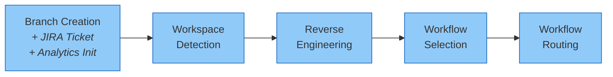
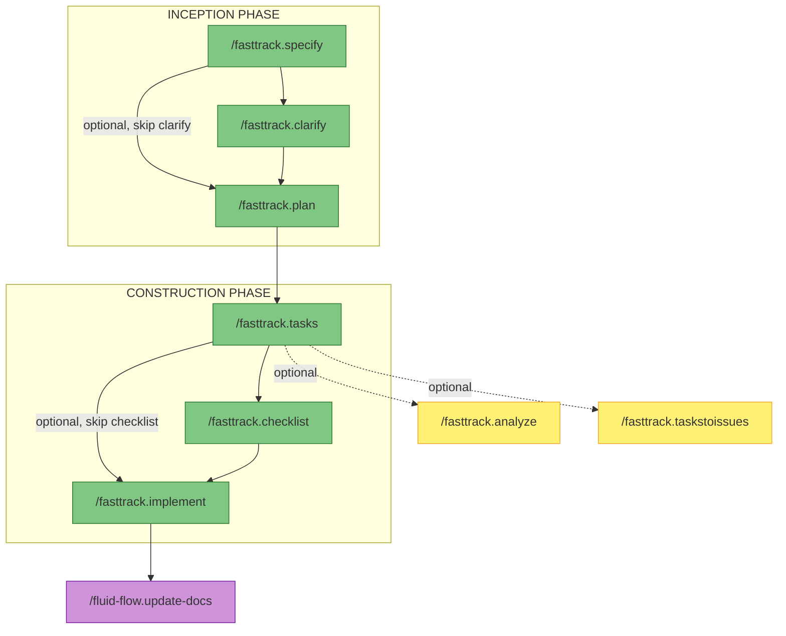

# Workflows

This document provides a detailed reference for both workflow paths in Fluid Flow AI: the **Shared Entry Point**, the **Fast-Track** path, and the **Comprehensive Path**.

---

## Table of Contents

- [Shared Entry Point](#shared-entry-point)
- [Fast-Track Workflow](#fast-track-workflow)
- [Comprehensive Path Workflow](#comprehensive-path-workflow)
- [Completion (Shared)](#completion-shared)
- [Workflow Guidance](#workflow-guidance)

---

## Shared Entry Point

Every development request passes through the same stages before being routed to a workflow. This ensures consistent branching, context gathering, and user-driven routing regardless of the chosen path.



### Stage 1: Branch Creation (Always)

**Purpose**: Create a feature branch, collect the JIRA ticket reference, initialise the feature directory, and create the feature analytics file.

**What happens**:
1. The user's request is parsed to extract a feature description
2. The user is prompted for a **JIRA Ticket Number** (parent initiative). Providing `null` or skipping is accepted; if provided, the ticket is stored in all feature documentation
3. A concise short name is generated (e.g., `add-user-auth`, `fix-payment-bug`)
4. The `create-new-feature` script (Bash `.sh` or PowerShell `.ps1`, auto-detected) creates the branch and directory:
   - Branch: `{JIRA-TICKET}-{description}` (e.g., `GXD-1732-add-user-authentication-flow`) or `{description}` when JIRA is null
   - Directory: `specs/{BRANCH_NAME}/`
5. `state.md` and `audit.md` are initialised in the feature directory (both include the JIRA ticket)
6. The `specs/_project/` directory is created if it does not exist
7. A **feature analytics file** is created at `main-workflow/analytics/{BRANCH_NAME}.md` with initial metadata, timestamps, and work metric counters
8. The initial user request is logged verbatim in `audit.md`

**Outputs**:
- Git branch `{JIRA-TICKET}-{description}` (or `{description}` when JIRA is null)
- `specs/{BRANCH_NAME}/state.md` (includes JIRA ticket)
- `specs/{BRANCH_NAME}/audit.md` (includes JIRA ticket)
- `main-workflow/analytics/{BRANCH_NAME}.md` (feature analytics)

---

### Stage 2: Workspace Detection (Always)

**Purpose**: Determine whether the workspace contains an existing project (brownfield) or is empty (greenfield).

**What happens**:
1. Check for existing feature state (resume if found)
2. Scan for source code files across all common languages
3. Check for build system indicators (package.json, pom.xml, etc.)
4. Identify workspace root directory
5. Determine brownfield/greenfield status
6. Check for existing reverse engineering artifacts

**Decision logic**:

| Scenario | Next Stage |
|----------|------------|
| Empty workspace (greenfield) | Workflow Selection |
| Existing code, RE artifacts exist | Workflow Selection (load existing RE as context) |
| Existing code, no RE artifacts | Reverse Engineering |

**Outputs**:
- Updated `specs/{BRANCH_NAME}/state.md` with workspace findings
- `specs/{BRANCH_NAME}/workspace-detection.md`

**Approval**: Not required -- this stage is informational and proceeds automatically.

---

### Stage 3: Reverse Engineering (Conditional -- Brownfield, Run-Once)

**Purpose**: Analyse the existing codebase and generate comprehensive design artifacts.

**Execute when**: Brownfield project detected AND no existing RE artifacts.

**Skip when**: Greenfield project OR RE artifacts already exist at `specs/_project/reverse-engineering/`.

**What happens**:
1. Multi-package discovery (scan all packages, infrastructure, build systems, services)
2. Business context analysis (business transactions, dictionary, domain understanding)
3. Generate 10 documentation artifacts:

| Artifact | Contents |
|----------|----------|
| `business-overview.md` | Business context diagram, transactions, dictionary |
| `architecture.md` | System overview, architecture diagram, data flow, integration points |
| `c4-architecture.md` | Full C4 model (Context, Container, Component, Code levels) |
| `code-structure.md` | Build system, key classes, file inventory, design patterns |
| `api-documentation.md` | REST APIs, internal APIs, data models |
| `component-inventory.md` | Application, infrastructure, shared, and test packages |
| `technology-stack.md` | Languages, frameworks, infrastructure, build tools |
| `dependencies.md` | Internal and external dependency maps |
| `code-quality-assessment.md` | Linting, style, documentation, technical debt |
| `test-coverage-analysis.md` | Baseline coverage metrics, test pyramid, gap analysis |

4. Create `reverse-engineering-timestamp.md` with metadata
5. Present findings for user review

**Outputs**: All artifacts written to `specs/_project/reverse-engineering/`

**Approval**: **Required** -- user must explicitly approve before proceeding.

---

### Stage 4: Workflow Selection (Always)

**Purpose**: Present the available workflows and let the user directly choose which one to follow.

**What happens**:
1. The user is presented with both workflow options:
   - **Fast-Track** -- Lightweight specification-driven workflow. Best for standard features, bug fixes, enhancements, CRUD operations, and work that does not require deep infrastructure or compliance design.
   - **Comprehensive Path** -- Full Architecture Decision Lifecycle. Best for complex infrastructure changes, multi-service integrations, projects requiring ADRs, NFR analysis, and formal architecture design.
2. The user replies with their choice (no AI recommendation is made -- this is purely user-driven)
3. The choice is logged in `audit.md`
4. `state.md` is updated with the selected workflow

**Approval**: The user's choice IS the decision. No AI recommendation to accept or override.

---

### Stage 5: Workflow Routing (Always)

**Purpose**: Route to the chosen workflow and begin execution.

Based on the user's choice:
- **Fast-Track**: The user is informed of the Fast-Track command sequence and the feature directory location. The workflow is ready for `/fasttrack.specify`.
- **Comprehensive Path**: The Comprehensive workflow rules are loaded and execution begins from Technical Scoping & Engineering Discovery (optional opt-in), then proceeds to Requirements Analysis. Workspace Detection and Reverse Engineering artifacts are carried forward as context.

---

## Fast-Track Workflow

A lightweight, command-driven pipeline for well-scoped features. Each command builds on the output of the previous one. Stages are organised into **Inception** (Specify, Clarify, Plan) and **Construction** (Tasks, Checklist, Implement) phases.



### Inception Phase

**Purpose**: Determine WHAT to build and HOW to approach it.

| # | Command | Required | Description |
|---|---------|----------|-------------|
| 1 | `/fasttrack.specify` | Yes | Converts the natural-language feature description into a structured specification (`spec.md`). Includes user scenarios, requirements, success criteria, and technology constraints. |
| 2 | `/fasttrack.clarify` | Optional | Identifies up to 5 underspecified areas in the current spec. Asks targeted clarification questions and encodes answers back into the spec. |
| 3 | `/fasttrack.plan` | Yes | Generates an implementation plan (`plan.md`) with architecture decisions, data models, API contracts, and dependency maps. References the constitution and brownfield context. |

### Construction Phase

**Purpose**: Build the feature according to the plan.

| # | Command | Required | Description |
|---|---------|----------|-------------|
| 4 | `/fasttrack.tasks` | Yes | Breaks the plan into an ordered, dependency-aware task list (`tasks.md`). Uses task IDs with optional `[P]` and `[US#]` labels plus file path references; validation is captured as "Independent Test" criteria at the user-story/phase level. |
| 5 | `/fasttrack.checklist` | Optional | Generates domain-specific quality checklists. Checklists act as "unit tests for requirements" -- they validate clarity and completeness, not implementation correctness. |
| 6 | `/fasttrack.implement` | Yes | Executes the task list with progress tracking. Checks prerequisite checklists before starting. Processes tasks in dependency order with approval gates. |

### Optional Commands

| # | Command | Description |
|---|---------|-------------|
| 7 | `/fasttrack.analyze` | Performs cross-artifact consistency analysis across spec, plan, and tasks. Non-destructive -- reports issues without modifying files. |
| 8 | `/fasttrack.taskstoissues` | Converts tasks into GitHub issues with labels, dependencies, and acceptance criteria. |
| 9 | `/fasttrack.constitution` | Create or update the project constitution from interactive or provided principle inputs, keeping dependent templates in sync. |

> **Analytics tracking**: `main-workflow/analytics/{BRANCH_NAME}.md` is updated after each Fast-Track phase and finalised with totals by the end of `/fasttrack.implement`.
>
> **Post-implementation**: After `/fasttrack.implement` completes, run **`/fluid-flow.update-docs`** (shared command) to update the remaining project documentation and reverse engineering artifacts.

### Fast-Track Artifacts

All artifacts are written to `specs/{BRANCH_NAME}/`:

```
specs/{BRANCH_NAME}/
├── state.md              # Progress tracking (includes JIRA ticket)
├── audit.md              # Full audit trail (includes JIRA ticket)
├── workspace-detection.md
├── spec.md               # Feature specification
├── plan.md               # Implementation plan
├── tasks.md              # Ordered task list
├── checklists/           # Domain-specific checklists
│   ├── ux.md
│   ├── security.md
│   └── ...
├── data-model.md         # Entity definitions (if applicable)
├── contracts/            # API contracts (if applicable)
└── research.md           # Research and decisions (if applicable)
```

Additionally, feature analytics are stored at:

```
main-workflow/analytics/{BRANCH_NAME}.md   # Feature analytics (timing, metrics, effort)
```

---

## Comprehensive Path Workflow

A comprehensive enterprise SDLC with three phases and adaptive depth. Stages are conditional -- the AI assesses which ones add value based on complexity, scope, and risk.

```mermaid
flowchart TB
    subgraph INCEPTION["INCEPTION PHASE"]
        direction TB
        I0["Technical Scoping &amp; Engineering Discovery<br/><i>Optional - user opt-in</i>"]
        I1["Requirements Analysis<br/><i>Always - Adaptive depth</i>"]
        I2["Onboarding Presentations<br/><i>Conditional</i>"]
        I3["User Stories<br/><i>Conditional</i>"]
        I3B["BDD Specification<br/><i>Conditional</i>"]
        I4["Workflow Planning<br/><i>Always</i>"]
        I5["Application Design<br/><i>Conditional</i>"]
        I6["Units Generation<br/><i>Conditional</i>"]
        I0 --> I1 --> I2 --> I3 --> I3B --> I4 --> I5 --> I6
    end

    subgraph CONSTRUCTION["CONSTRUCTION PHASE"]
        direction TB
        C0["Per-Unit Loop"]
        C1["Functional Design"]
        C2["NFR Requirements"]
        C3["NFR Design"]
        C4["Infrastructure Design"]
        C5["Code Generation"]
        C6["Onboarding Update"]
        C7["Build and Test<br/><i>Always</i>"]
        C0 --> C1 --> C2 --> C3 --> C4 --> C5 --> C6
        C6 -->|"Next unit"| C0
        C6 -->|"All units done"| C7
    end

    subgraph POSTIMPL["POST-IMPLEMENTATION<br/>(Separate Command)"]
        direction TB
        P1["Test Coverage Delta"]
        P2["RE Update"]
        P3["Analytics Reconciliation<br/><i>Idempotent</i>"]
        P1 --> P2 --> P3
    end

    subgraph OPERATIONS["OPERATIONS PHASE"]
        O1["Placeholder<br/><i>Future expansion</i>"]
    end

    INCEPTION --> CONSTRUCTION --> POSTIMPL --> OPERATIONS

    style INCEPTION fill:#90CAF9,stroke:#1565C0,stroke-width:2px
    style CONSTRUCTION fill:#81C784,stroke:#2E7D32,stroke-width:2px
    style POSTIMPL fill:#CE93D8,stroke:#7B1FA2,stroke-width:2px
    style OPERATIONS fill:#FFB74D,stroke:#E65100,stroke-width:2px
```



### Inception Phase

**Purpose**: Determine WHAT to build and WHY.

| Stage | Condition | Depth Levels | Description |
|-------|-----------|-------------|-------------|
| **Technical Scoping & Engineering Discovery** | Optional (user opt-in) | N/A | Assess engineering size and complexity; identify affected systems and risk signals; recommend single-initiative or decomposition into sub-initiatives, each assigned to Fast-Track or Comprehensive Path |
| **Requirements Analysis** | Always | Minimal / Standard / Comprehensive | Analyse intent, gather functional and non-functional requirements, generate requirements document |
| **Onboarding Presentations** | Conditional (brownfield or stale) | N/A | Generate engineer and product manager onboarding presentations from RE artifacts |
| **User Stories** | Conditional (user-facing changes) | Minimal / Standard / Comprehensive | Two-part: Planning (questions + answers) then Generation (stories + personas) |
| **BDD Specification** | Conditional (stories with acceptance criteria, complex business rules, or QA stakeholders) | N/A | Two-part: Planning (domain language, framework, scenario structure) then Generation (Gherkin feature files, BDD strategy, step catalogue). Produces `inception/bdd/` artifacts. |
| **Workflow Planning** | Always | N/A | Determine which construction stages to execute, set depth levels, create execution visualisation |
| **Application Design** | Conditional (new components) | Minimal / Standard / Comprehensive | Define component methods, business rules, service layer design |
| **Units Generation** | Conditional (multiple units) | Minimal / Standard / Comprehensive | Decompose system into units of work with dependencies |

### Construction Phase

**Purpose**: Determine HOW to build it.

The Construction phase uses a **per-unit loop**. Each unit of work is completed fully (design through code generation) before the next unit starts.

**Per-Unit Stages**:

| Stage | Condition | Description |
|-------|-----------|-------------|
| **Functional Design** | Conditional (new data models, complex logic) | Detailed design of data models, business logic, and rules |
| **NFR Requirements** | Conditional (performance, security, scalability) | Non-functional requirements assessment and tech stack selection |
| **NFR Design** | Conditional (follows NFR Requirements) | NFR pattern design and incorporation |
| **Infrastructure Design** | Conditional (cloud resources, deployment) | Infrastructure service mapping and deployment architecture |
| **Code Generation** | Always | Two-part: Planning (detailed steps) then Generation (code, tests, artifacts). If BDD Specification was executed, also generates step definition classes wired to domain logic. |
| **Onboarding Update** | Conditional (feature/API/operational changes) | Update feature registry and onboarding presentations |

**Post-Unit Stages**:

| Stage | Condition | Description |
|-------|-----------|-------------|
| **Build and Test** | Always | Generate build instructions, unit/integration/performance/BDD test instructions. If BDD Specification was executed, generates `bdd-test-instructions.md` with framework-specific execution commands and scenario traceability guidance. |

### Post-Implementation Documentation (Separate Command)

After the Construction phase completes, the following steps are handled by the shared command **`/fluid-flow.update-docs`** (not part of the Comprehensive Path workflow itself):

| Step | Condition | Description |
|------|-----------|-------------|
| **Test Coverage Delta** | Conditional (baseline exists) | Compare coverage against Phase 1 baseline, generate improvement plan |
| **RE Update** | Conditional (RE artifacts exist) | Incrementally update all reverse engineering artifacts |

> **Analytics tracking**: `main-workflow/analytics/{BRANCH_NAME}.md` is updated after each Comprehensive stage and finalised with totals by the end of Build and Test.

### Operations Phase

**Status**: Placeholder for future expansion.

Planned capabilities: deployment planning, monitoring setup, incident response, maintenance workflows, production readiness checklists.

### Comprehensive Path Artifacts

```
specs/{BRANCH_NAME}/
├── state.md                      # Includes JIRA ticket
├── audit.md                      # Includes JIRA ticket
├── workspace-detection.md
├── inception/
│   ├── technical-scoping/            # Technical Scoping & Engineering Discovery output
│   │   └── technical-scoping-report.md
│   ├── plans/
│   ├── requirements/
│   ├── user-stories/
│   ├── bdd/                          # BDD Specification stage output
│   │   ├── features/                 # Gherkin .feature files
│   │   ├── bdd-strategy.md           # Framework, tagging, test data strategy
│   │   └── step-catalogue.md         # All steps with domain meaning
│   ├── onboarding/
│   │   ├── engineers/
│   │   └── product/
│   └── application-design/
├── construction/
│   ├── plans/
│   ├── {unit-name}/
│   │   ├── functional-design/        # Includes bdd-step-mapping.md when BDD was executed
│   │   ├── nfr-requirements/
│   │   ├── nfr-design/
│   │   ├── infrastructure-design/
│   │   └── code/                     # Includes bdd-step-definitions-summary.md when BDD was executed
│   ├── build-and-test/
│   │   ├── build-instructions.md
│   │   ├── unit-test-instructions.md
│   │   ├── integration-test-instructions.md
│   │   ├── performance-test-instructions.md
│   │   ├── bdd-test-instructions.md  # Generated when BDD Specification was executed
│   │   └── build-and-test-summary.md
│   └── coverage-improvement-plan.md  # Generated by /fluid-flow.update-docs
├── operations/
└── features/
    └── features-registry.md
```

Additionally, feature analytics are stored at:

```
main-workflow/analytics/{BRANCH_NAME}.md   # Feature analytics (timing, metrics, effort)
```

---

## Completion (Shared)

This stage runs after either workflow path completes (Fast-Track or Comprehensive Path). Both paths converge into the shared Completion stage.

| Step | Description |
|------|-------------|
| **1. Commit** | Commit changes using conventional commits format. User approval is required before committing. |
| **2. Pull Request** | Push the branch, create a pull request, and present the PR link to the user. |
| **3. Change Risk Report** | Generate a change risk report via `/fluid-flow.risk-report` and attach it to the pull request. |

---

## Workflow Guidance

At the Workflow Selection stage, the user is presented with two options. There is no AI-driven assessment or recommendation -- the user reads the descriptions and makes their own choice.

The descriptions presented to the user are:

| Workflow | Description |
|----------|-------------|
| **Fast-Track** | Lightweight specification-driven workflow. Best for: standard features, bug fixes, enhancements, CRUD operations, and work that does not require deep infrastructure or compliance design. |
| **Comprehensive Path** | Full Architecture Decision Lifecycle. Best for: complex infrastructure changes, multi-service integrations, projects requiring ADRs, NFR analysis, and formal architecture design. |
| **Completion (Shared)** | Both paths converge into the shared Completion stage: Commit (conventional format, user approval), Pull Request (push branch, create PR, present link), and Change Risk Report (via `/fluid-flow.risk-report`, attached to PR). |

The user replies with **1** or **2** (or the workflow name) to make their selection. The choice is logged in the audit trail and the workflow begins immediately.
