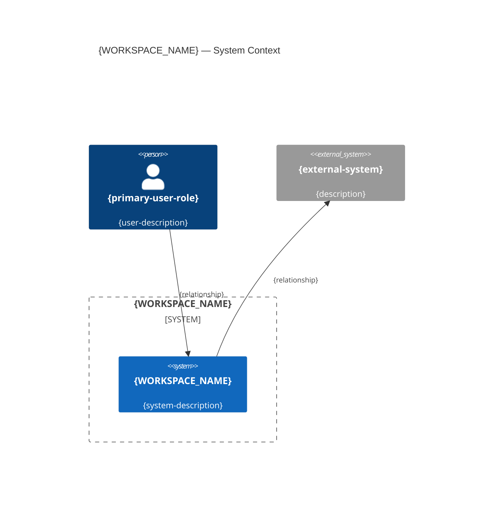
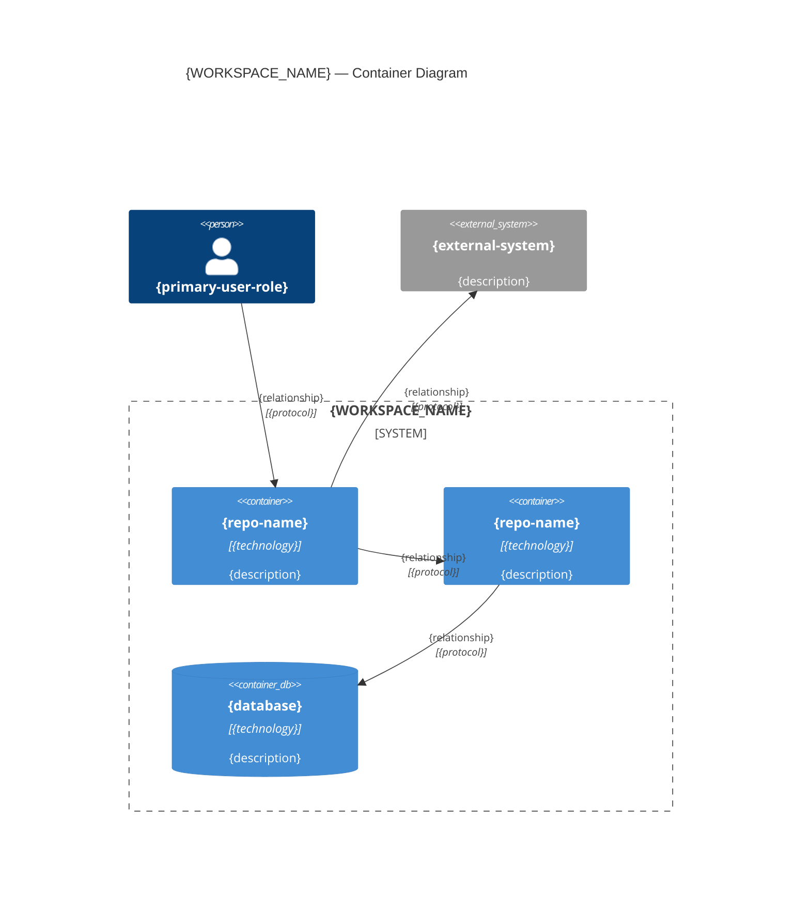
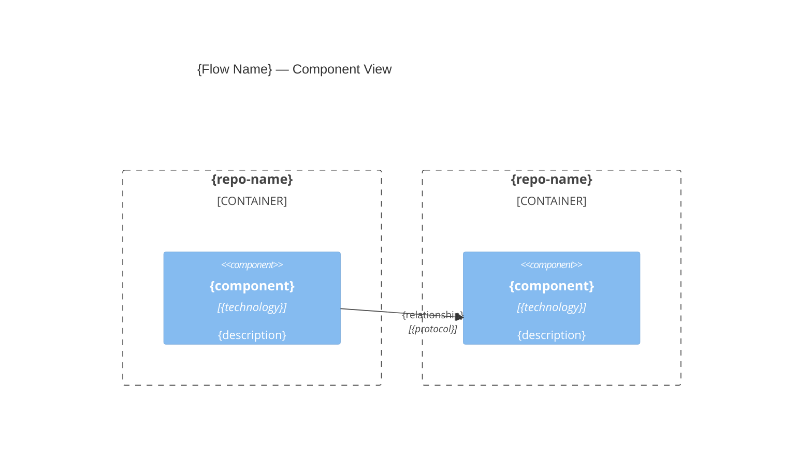

# Combined C4 Architecture

**Workspace**: {WORKSPACE_NAME}
**Last Generated**: {ISO_TIMESTAMP}

## Level 1: System Context

The bounded context as a system, showing external actors and external systems.

## Level 2: Container

Each repository is a container. Shows relationships between repos.

## Level 3: Component (Cross-Repo Flows)

Key components within each repo that participate in cross-repo flows.

### {Flow Name 1}

{Repeat for each major cross-repo flow.}

## Level 4

Omitted at workspace level. Available in per-repo `c4-architecture.md` files:

| Repository | Per-Repo C4 Location |
|------------|---------------------|
| {repo-name} | `{repo}/reverse-engineering/c4-architecture.md` |
