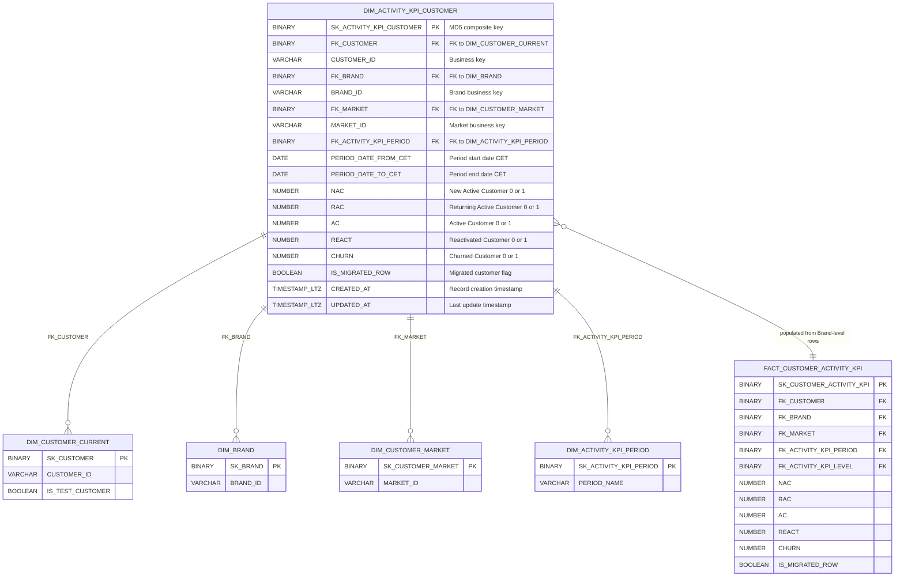
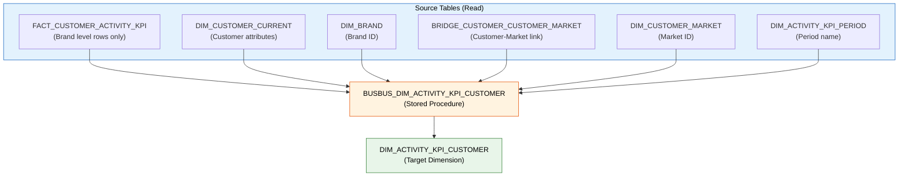

# Data Model: DIM_ACTIVITY_KPI_CUSTOMER

**Branch**: `001-add-bv-dim-activity-kpi-customer`
**Date**: 2026-02-08

## Entity Relationship Diagram



## Table Definition: DIM_ACTIVITY_KPI_CUSTOMER

### Columns

| # | Column | Type | Nullable | Description | Source |
|---|--------|------|----------|-------------|--------|
| 1 | SK_ACTIVITY_KPI_CUSTOMER | BINARY | NOT NULL | Surrogate key (composite MD5) | Generated |
| 2 | FK_CUSTOMER | BINARY | NOT NULL | FK to DIM_CUSTOMER_CURRENT.SK_CUSTOMER | FACT_CUSTOMER_ACTIVITY_KPI.FK_CUSTOMER |
| 3 | CUSTOMER_ID | VARCHAR | NOT NULL | Customer business key | DIM_CUSTOMER_CURRENT.CUSTOMER_ID |
| 4 | FK_BRAND | BINARY | NOT NULL | FK to DIM_BRAND.SK_BRAND | FACT_CUSTOMER_ACTIVITY_KPI.FK_BRAND |
| 5 | BRAND_ID | VARCHAR | NOT NULL | Brand business key | DIM_BRAND.BRAND_ID |
| 6 | FK_MARKET | BINARY | NOT NULL | FK to DIM_CUSTOMER_MARKET | FACT_CUSTOMER_ACTIVITY_KPI.FK_MARKET |
| 7 | MARKET_ID | VARCHAR | NOT NULL | Market business key | DIM_CUSTOMER_MARKET.MARKET_ID |
| 8 | FK_ACTIVITY_KPI_PERIOD | BINARY | NOT NULL | FK to DIM_ACTIVITY_KPI_PERIOD | FACT_CUSTOMER_ACTIVITY_KPI.FK_ACTIVITY_KPI_PERIOD |
| 9 | PERIOD_DATE_FROM_CET | DATE | NOT NULL | Period start date (CET) | FACT_CUSTOMER_ACTIVITY_KPI.PERIOD_DATE_FROM_CET |
| 10 | PERIOD_DATE_TO_CET | DATE | NOT NULL | Period end date (CET) | FACT_CUSTOMER_ACTIVITY_KPI.PERIOD_DATE_TO_CET |
| 11 | NAC | NUMBER(38,0) | NOT NULL | New Active Customer flag (0/1) | FACT_CUSTOMER_ACTIVITY_KPI.NAC |
| 12 | RAC | NUMBER(38,0) | NOT NULL | Returning Active Customer flag (0/1) | FACT_CUSTOMER_ACTIVITY_KPI.RAC |
| 13 | AC | NUMBER(38,0) | NOT NULL | Active Customer flag (0/1) | FACT_CUSTOMER_ACTIVITY_KPI.AC |
| 14 | REACT | NUMBER(38,0) | NOT NULL | Reactivated Customer flag (0/1) | FACT_CUSTOMER_ACTIVITY_KPI.REACT |
| 15 | CHURN | NUMBER(38,0) | NOT NULL | Churned Customer flag (0/1) | FACT_CUSTOMER_ACTIVITY_KPI.CHURN |
| 16 | IS_MIGRATED_ROW | BOOLEAN | | Migrated customer flag | FACT_CUSTOMER_ACTIVITY_KPI.IS_MIGRATED_ROW |
| 17 | CREATED_AT | TIMESTAMP_LTZ(9) | NOT NULL | Record creation timestamp | SYSDATE() |
| 18 | UPDATED_AT | TIMESTAMP_LTZ(9) | | Last update timestamp | NULL on insert |

### Surrogate Key Generation

```sql
MD5(UPPER(ARRAY_TO_STRING(ARRAY_CONSTRUCT(
    TRIM(UPPER(CUSTOMER_ID)),
    TRIM(UPPER(BRAND_ID)),
    TRIM(UPPER(MARKET_ID)),
    TRIM(UPPER(PERIOD_NAME)),
    PERIOD_DATE_FROM_CET,
    PERIOD_DATE_TO_CET
),'^')))::BINARY AS SK_ACTIVITY_KPI_CUSTOMER
```

### Row Filter (Brand Level Only)

```sql
WHERE FK_ACTIVITY_KPI_LEVEL = MD5(UPPER('Brand'))::BINARY
  AND CC.IS_TEST_CUSTOMER = 0
```

### Source Query Pattern

```sql
SELECT
    -- Surrogate key (composite MD5)
    MD5(UPPER(ARRAY_TO_STRING(ARRAY_CONSTRUCT(
        TRIM(UPPER(CC.CUSTOMER_ID)),
        TRIM(UPPER(B.BRAND_ID)),
        TRIM(UPPER(CM.MARKET_ID)),
        TRIM(UPPER(P.PERIOD_NAME)),
        F.PERIOD_DATE_FROM_CET,
        F.PERIOD_DATE_TO_CET
    ),'^')))::BINARY AS SK_ACTIVITY_KPI_CUSTOMER,
    -- Customer attributes
    F.FK_CUSTOMER,
    CC.CUSTOMER_ID,
    -- Brand attributes
    F.FK_BRAND,
    B.BRAND_ID,
    -- Market attributes
    F.FK_MARKET,
    CM.MARKET_ID,
    -- Period attributes
    F.FK_ACTIVITY_KPI_PERIOD,
    F.PERIOD_DATE_FROM_CET,
    F.PERIOD_DATE_TO_CET,
    -- KPI flags
    F.NAC,
    F.RAC,
    F.AC,
    F.REACT,
    F.CHURN,
    F.IS_MIGRATED_ROW,
    -- Metadata
    SYSDATE() AS CREATED_AT,
    NULL AS UPDATED_AT
FROM BUSINESS_VAULT.FACT_CUSTOMER_ACTIVITY_KPI F
INNER JOIN BUSINESS_VAULT.DIM_CUSTOMER_CURRENT CC 
    ON CC.SK_CUSTOMER = F.FK_CUSTOMER
INNER JOIN BUSINESS_VAULT.DIM_BRAND B 
    ON B.SK_BRAND = F.FK_BRAND
INNER JOIN BUSINESS_VAULT.BRIDGE_CUSTOMER_CUSTOMER_MARKET BCCM 
    ON BCCM.FK_CUSTOMER = F.FK_CUSTOMER 
    AND BCCM.IS_CURRENT
INNER JOIN BUSINESS_VAULT.DIM_CUSTOMER_MARKET CM 
    ON CM.SK_CUSTOMER_MARKET = BCCM.FK_CUSTOMER_MARKET
INNER JOIN BUSINESS_VAULT.DIM_ACTIVITY_KPI_PERIOD P 
    ON P.SK_ACTIVITY_KPI_PERIOD = F.FK_ACTIVITY_KPI_PERIOD
WHERE F.FK_ACTIVITY_KPI_LEVEL = MD5(UPPER('Brand'))::BINARY
    AND CC.IS_TEST_CUSTOMER = 0
    AND F.PERIOD_DATE_FROM_CET = $CURR_PERIOD_DATE_FROM
    AND F.PERIOD_DATE_TO_CET = $CURR_PERIOD_DATE_TO
    AND F.FK_ACTIVITY_KPI_PERIOD = MD5(UPPER($PERIOD_LEVEL_STRING))::BINARY
```

## Data Flow Diagram



## Validation Rules

1. **Uniqueness**: `SK_ACTIVITY_KPI_CUSTOMER` must be unique (guaranteed by composite MD5 of natural key)
2. **Completeness**: Every Brand-level row in FACT_CUSTOMER_ACTIVITY_KPI (excluding test customers) must have a corresponding row in DIM_ACTIVITY_KPI_CUSTOMER after refresh
3. **Exclusivity**: KPI flags are mutually exclusive groupings per the fact table logic (NAC+AC, RAC+AC, REACT+AC, or CHURN alone)
4. **Test customer exclusion**: No rows where DIM_CUSTOMER_CURRENT.IS_TEST_CUSTOMER = 1
