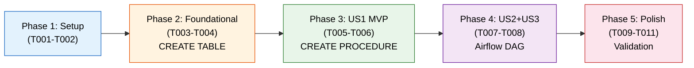

# Tasks: DIM_ACTIVITY_KPI_CUSTOMER

**Input**: Design documents from `specs/001-add-bv-dim-activity-kpi-customer/`
**Prerequisites**: plan.md, spec.md, research.md, data-model.md, quickstart.md

**Tests**: No automated test framework exists in this project. Validation is performed via SQL queries (included in Phase 5).

**Organization**: Tasks are grouped by user story to enable independent implementation and testing of each story.

## Format: `[ID] [P?] [Story] Description`

- **[P]**: Can run in parallel (different files, no dependencies)
- **[Story]**: Which user story this task belongs to (e.g., US1, US2, US3)
- Include exact file paths in descriptions

## Path Conventions

- **SQL DDL/DML**: `data-snowflake-dwh-dev/business_vault/activity_kpi/`
- **Stored Procedures**: `data-snowflake-dwh-dev/business_vault/activity_kpi/procs/`
- **Airflow DAGs**: `data-airflow-dags-dev/activity_kpi/`

---

## Phase 1: Setup (Directory Structure)

**Purpose**: Create directory structure for new SQL migration files

- [x] T001 Create directory `data-snowflake-dwh-dev/business_vault/activity_kpi/tables/DIM_ACTIVITY_KPI_CUSTOMER/`
- [x] T002 [P] Create directory `data-snowflake-dwh-dev/business_vault/activity_kpi/procs/BUSBUS_DIM_ACTIVITY_KPI_CUSTOMER/`

---

## Phase 2: Foundational (Table DDL)

**Purpose**: Create the dimension table in Snowflake - MUST be complete before stored procedure or Airflow integration

**CRITICAL**: No user story work can begin until this phase is complete

- [x] T003 Create dimension table DDL in `data-snowflake-dwh-dev/business_vault/activity_kpi/tables/DIM_ACTIVITY_KPI_CUSTOMER/V2026_02_08_120000_1__TBL_DIM_ACTIVITY_KPI_CUSTOMER.sql` with CREATE TABLE statement per data-model.md (18 columns: SK_ACTIVITY_KPI_CUSTOMER, FK_CUSTOMER, CUSTOMER_ID, FK_BRAND, BRAND_ID, FK_MARKET, MARKET_ID, FK_ACTIVITY_KPI_PERIOD, PERIOD_DATE_FROM_CET, PERIOD_DATE_TO_CET, NAC, RAC, AC, REACT, CHURN, IS_MIGRATED_ROW, CREATED_AT, UPDATED_AT)
- [x] T004 [P] Create undo script in `data-snowflake-dwh-dev/business_vault/activity_kpi/tables/DIM_ACTIVITY_KPI_CUSTOMER/U2026_02_08_120000_1__TBL_DIM_ACTIVITY_KPI_CUSTOMER.sql` with DROP TABLE IF EXISTS statement

**Checkpoint**: Dimension table DDL ready for deployment

---

## Phase 3: User Story 1 - Query Customer Activity KPI with Customer Attributes (Priority: P1) MVP

**Goal**: Create the stored procedure that populates DIM_ACTIVITY_KPI_CUSTOMER by joining FACT_CUSTOMER_ACTIVITY_KPI (Brand level) with DIM_CUSTOMER_CURRENT, DIM_BRAND, and DIM_CUSTOMER_MARKET.

**Independent Test**: Query the dimension table after running the stored procedure and verify each row contains customer ID, brand, market, and KPI flags (NAC/RAC/AC/REACT/CHURN) for a given period.

### Implementation for User Story 1

- [x] T005 [US1] Create stored procedure in `data-snowflake-dwh-dev/business_vault/activity_kpi/procs/BUSBUS_DIM_ACTIVITY_KPI_CUSTOMER/V2026_02_08_120100_3__PROC__BUSBUS_DIM_ACTIVITY_KPI_CUSTOMER.sql` - JavaScript stored procedure that: (1) accepts PERIOD_LEVEL parameter (MONTHLY/3_MONTHS_ROLLING), (2) calculates period date ranges, (3) checks if period already processed (idempotency), (4) INSERTs into DIM_ACTIVITY_KPI_CUSTOMER by joining FACT_CUSTOMER_ACTIVITY_KPI (Brand level only, FK_ACTIVITY_KPI_LEVEL = MD5(UPPER('Brand'))::BINARY) with DIM_CUSTOMER_CURRENT (IS_TEST_CUSTOMER = 0), DIM_BRAND, BRIDGE_CUSTOMER_CUSTOMER_MARKET, DIM_CUSTOMER_MARKET, and DIM_ACTIVITY_KPI_PERIOD. Use composite MD5 surrogate key per data-model.md.
- [x] T006 [P] [US1] Create undo script in `data-snowflake-dwh-dev/business_vault/activity_kpi/procs/BUSBUS_DIM_ACTIVITY_KPI_CUSTOMER/U2026_02_08_120100_3__PROC__BUSBUS_DIM_ACTIVITY_KPI_CUSTOMER.sql` with DROP PROCEDURE IF EXISTS statement

**Checkpoint**: At this point, the dimension table can be populated by manually calling `CALL BUSINESS_VAULT.BUSBUS_DIM_ACTIVITY_KPI_CUSTOMER('MONTHLY')` and queried to verify customer attributes alongside KPI flags.

---

## Phase 4: User Story 2 & 3 - Downstream Joins and Automated Airflow Refresh (Priority: P2)

**Goal**: Integrate the dimension refresh into the Activity KPI Airflow DAG so it runs automatically after fact processing.

**Independent Test**: Trigger the Airflow DAG and verify the dimension table is populated with current data after the DAG completes.

### Implementation for User Stories 2 & 3

- [x] T007 [US2] Create dimension task group in `data-airflow-dags-dev/activity_kpi/taskgroup_02_bus_dims.py` following the pattern from `taskgroup_01_bus_facts.py` - create tasks that call `BUSBUS_DIM_ACTIVITY_KPI_CUSTOMER` for MONTHLY and 3_MONTHS_ROLLING periods using DoubleTemplatedBashOperator. Include a `dims_done` completion marker task with `NONE_FAILED_MIN_ONE_SUCCESS` trigger rule.
- [x] T008 [US3] Modify `data-airflow-dags-dev/activity_kpi/activity_kpi_dag.py` to import and wire the new dimension task group - dimension processing must run AFTER fact processing (facts_done >> dims_start), since the dimension reads from FACT_CUSTOMER_ACTIVITY_KPI.

**Checkpoint**: The full Airflow DAG now processes facts first, then dimensions. The dimension table is automatically refreshed on the monthly schedule.

---

## Phase 5: Polish & Validation

**Purpose**: Validate the implementation and ensure data quality

- [x] T009 Run validation queries from quickstart.md: (1) Row count comparison between Brand-level fact rows and dimension rows, (2) Test customer exclusion check, (3) Duplicate surrogate key check, (4) Sample data review
- [x] T010 Verify idempotency by re-running the stored procedure for the same period and confirming no duplicate rows are created
- [x] T011 Run quickstart.md full validation checklist

---

## Dependencies & Execution Order

### Phase Dependencies

- **Setup (Phase 1)**: No dependencies - can start immediately
- **Foundational (Phase 2)**: Depends on Phase 1 directories existing - BLOCKS all user stories
- **User Story 1 (Phase 3)**: Depends on Phase 2 (table must exist before procedure can INSERT into it)
- **User Stories 2 & 3 (Phase 4)**: Depends on Phase 3 (stored procedure must exist before Airflow can call it)
- **Polish (Phase 5)**: Depends on Phases 2, 3, 4 all being complete

### User Story Dependencies

- **User Story 1 (P1)**: Can start after Foundational (Phase 2) - MVP deliverable
- **User Stories 2 & 3 (P2)**: Depend on US1 (Airflow calls the stored procedure created in US1)
- **Note**: US2 and US3 are combined in Phase 4 because both relate to Airflow integration and are naturally sequential

### Within Each Phase

- T001 and T002 can run in parallel [P]
- T003 and T004 can run in parallel [P]
- T005 and T006 can run in parallel [P]
- T007 must complete before T008 (DAG references the task group)

### Parallel Opportunities

- Phase 1: Both directory creation tasks (T001, T002) can run in parallel
- Phase 2: DDL and undo script (T003, T004) can run in parallel
- Phase 3: Procedure and undo script (T005, T006) can run in parallel

---

## Implementation Strategy

### MVP First (User Story 1 Only)

1. Complete Phase 1: Create directories
2. Complete Phase 2: Deploy table DDL to Snowflake
3. Complete Phase 3: Deploy stored procedure
4. **STOP and VALIDATE**: Manually call `CALL BUSINESS_VAULT.BUSBUS_DIM_ACTIVITY_KPI_CUSTOMER('MONTHLY')` and query the dimension
5. Confirm customers appear with correct KPI flags

### Incremental Delivery

1. Phase 1 + Phase 2 → Table exists in Snowflake
2. Phase 3 → Manually callable stored procedure (MVP)
3. Phase 4 → Fully automated via Airflow
4. Phase 5 → Validated and production-ready

---

## Notes

- All SQL files follow the existing `V{TIMESTAMP}_{seq}__{TYPE}_{NAME}.sql` / `U{TIMESTAMP}_{seq}__{TYPE}_{NAME}.sql` naming convention
- The timestamp `2026_02_08_120000` is used for the table DDL and `2026_02_08_120100` for the stored procedure to ensure correct ordering
- The sequence number `_1__` is for table DDL and `_3__` is for stored procedures (matching existing convention)
- Undo scripts are created alongside each version script for rollback capability
- The Airflow task group uses number `02` (not `00`) because the dimension must run AFTER facts (`01`)
