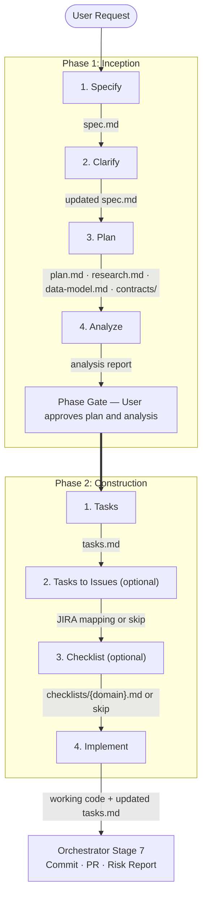

## When to Use

| Criteria | Fast-Track | Consider Comprehensive-Path Instead |
|----------|------------|--------------------------------------|
| Scope | Single feature, bug fix, or small enhancement | Multi-feature, cross-cutting concern, platform change |
| Complexity | Low-to-medium; well-understood domain | High; novel domain, many unknowns, regulatory |
| Team | Solo developer or small team | Multi-team coordination needed |
| Unknowns | Few; existing patterns can be reused | Many; requires research, spikes, or ADRs |
| Operations | No special ops planning needed | Needs failure-mode analysis, runbooks, on-call impact |

## Session Variables (provided by orchestrator)

| Variable | Source | Used by |
|----------|--------|---------|
| `SHELL_TYPE` | Stage 0 (shell detection) | All steps (script selection) |
| `DEPT_FF_PATH` | Stage 3 (local repo detection) | All steps (artifact paths) |
| `INITIATIVE_NAME` | Stage 5 (initiative creation) | All steps (artifact paths) |

Artifact root: `{DEPT_FF_PATH}/initiatives/{INITIATIVE_NAME}/artefacts/`

## Phases

| Phase | Name | Steps | Goal |
|-------|------|-------|------|
| 1 | Inception | 4 | Complete specification, plan, and quality analysis |
| 2 | Construction | 4 | Tasks, JIRA issues (optional), checklists (optional), implemented code |

## Step Breakdown

### Phase 1: Inception

| # | Step | Conditional | Key Inputs | Key Outputs | Gate |
|---|------|-------------|------------|-------------|------|
| 1 | **Specify** | No | User's feature description, brownfield context | `spec.md`, `checklists/requirements.md` | User acknowledges spec |
| 2 | **Clarify** | No | `spec.md` | Updated `spec.md` with clarifications integrated | User acknowledges coverage summary |
| 3 | **Plan** | No | `spec.md`, `constitution.md`, brownfield context | `plan.md`, `research.md`, `data-model.md`, `contracts/` | User approves plan |
| 4 | **Analyze** | No | `spec.md`, `plan.md`, `constitution.md` | Analysis report (displayed, not written) | User acknowledges report |

### Phase 2: Construction

| # | Step | Conditional | Key Inputs | Key Outputs | Gate |
|---|------|-------------|------------|-------------|------|
| 1 | **Tasks** | No | `plan.md`, `spec.md`, optional design artifacts | `tasks.md` | User approves task breakdown |
| 2 | **Tasks to Issues** | Yes -- skip if no JIRA or user declines | `tasks.md`, JIRA project/parent | JIRA issues, updated `tasks.md` with mapping | User acknowledges mapping or skip |
| 3 | **Checklist** | Yes -- skip unless user requests domain-specific quality checklists | `spec.md`, `plan.md`, `tasks.md` | `checklists/{domain}.md` (one per run) | User acknowledges checklist |
| 4 | **Implement** | No | `tasks.md`, `plan.md`, all design artifacts, brownfield context | All files created/modified per task plan; updated `tasks.md` with checkboxes | User confirms implementation is complete |

## Artifact Flow

## Conditional Step Logic

- **Clarify** (step 2): Always runs after Specify. Even when no critical ambiguities are detected, the AI generates a small set of targeted questions to surface hidden assumptions and sharpen the spec before planning begins.
- **Tasks to Issues** (step 2, construction): Skip if Atlassian MCP is unavailable or user declines. Presents: "Create JIRA issues from the task breakdown?" (A: Yes, B: No).
- **Checklist** (step 3, construction): Only runs if the user explicitly requests a domain-specific quality checklist. Multiple runs are allowed for different domains. If not requested, skip.

## Exit Criteria

When the fast-track workflow completes (Phase 2 gate passed), the orchestrator expects:

1. **Artifacts produced** (at minimum):
   - `spec.md` -- approved feature specification
   - `plan.md` -- approved implementation plan
   - `tasks.md` -- approved and fully checked-off task breakdown
   - `checklists/requirements.md` -- spec quality checklist (auto-generated by Specify)

2. **Code delivered**: All files created/modified as specified in the task plan

3. **Ready for**: Orchestrator Stage 7 (commit, PR, risk report)

## Workflow-Specific Resources

| Resource | Path (relative to workflow root) | Purpose |
|----------|----------------------------------|---------|
| Templates | `templates/` | Spec, plan, tasks, and checklist structures |
| Scripts (bash) | `scripts/bash/` | Feature scaffolding, prerequisites, agent context |
| Scripts (powershell) | `scripts/powershell/` | Same scripts for Windows environments |
| Constitution | `knowledge-core/constitution.md` | Project-level design principles and gates |

## Phase Chain

1. Load `1-inception/1-inception.md` -- execute steps 1-4
2. Load `2-construction/2-construction.md` -- execute steps 1-4 (respecting conditional logic for Tasks to Issues and Checklist)
