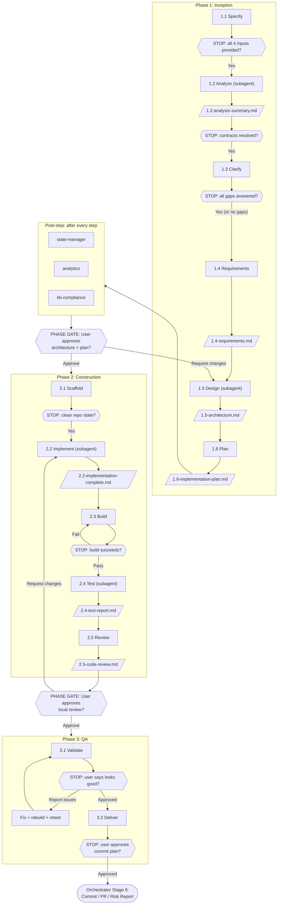

# FE Migration: Angular to StencilJS

Migrate Angular widgets from a source repository to StencilJS MFEs in a target repository, following a structured 3-phase lifecycle.

## When to Use

- Migrating an Angular widget (from `sb-b2b-fe-app` or similar) to a StencilJS MFE (in `sb-fe-mfe` or similar)
- The JIRA epic and acceptance criteria have already been created (via a prior analysis workflow or manually)

## Flow



## Steps Detail

### Phase 1: Inception

| Step | Name | What it does | Subagent | Artifact |
|------|------|-------------|----------|----------|
| 1.1 | Specify | Collect JIRA key, entry point, widget name, target type | No | -- |
| 1.2 | Analyze | Deep widget analysis + BFF contract extraction | Yes | `1.2-analysis-summary.md` |
| 1.3 | Clarify | Screenshots, gap identification, question resolution | No | -- |
| 1.4 | Requirements | Formal requirements (functional, data, visual) | No | `1.4-requirements.md` |
| 1.5 | Design | Component decomposition, reusability scan, architecture | Yes | `1.5-architecture.md` |
| 1.6 | Plan | Implementation plan with ordered tasks | No | `1.6-implementation-plan.md` |

### Phase 2: Construction

| Step | Name | What it does | Subagent | Artifact |
|------|------|-------------|----------|----------|
| 2.1 | Scaffold | Branch creation, project scaffold, deps install | No | -- |
| 2.2 | Implement | Code generation (build-first approach) | Yes | `2.2-implementation-complete.md` |
| 2.3 | Build | Verify compilation, fix errors | No | -- |
| 2.4 | Test | Unit tests + Storybook stories | Yes | `2.4-test-report.md` |
| 2.5 | Review | Requirements verification + code review | No | `2.5-code-review.md` |

### Phase 3: QA

| Step | Name | What it does | Subagent | Artifact |
|------|------|-------------|----------|----------|
| 3.1 | Validate | Fix loop until user approves | No | -- |
| 3.2 | Deliver | Logical commits + push to origin | No | -- |

## Templates

Output templates live in each step's `templates/` folder:

| Template | Step | Purpose |
|----------|------|---------|
| `1.2-analysis-summary.template.md` | 1.2 Analyze | Widget analysis checkpoint |
| `1.4-requirements.template.md` | 1.4 Requirements | Structured requirements with ACs |
| `1.5-architecture.template.md` | 1.5 Design | Permanent architecture reference |
| `1.6-implementation-plan.template.md` | 1.6 Plan | Temporary task document |
| `2.5-code-review.template.md` | 2.5 Review | Scored code review |

## Knowledge Core

Cross-cutting reference material shared across multiple phases and steps. Lives in `knowledge-core/`:

| File | Covers | Referenced by |
|------|--------|---------------|
| `shadow-dom-css-rules.md` | Two mandatory Shadow DOM CSS rules (class placement on wrapper, flat selectors) | 2.2, 2.3, 2.4, 2.5 |
| `event-bus-access.md` | Mandatory `window.sbXpEventBus` rule (never import `EventBus` directly) | 1.5, 2.2, 2.4, 2.5 |
| `bff-data-fetching.md` | Three mandatory BFF rules (named type alias, dual guard, full envelope in mocks) | 2.2, 2.4, 2.5 |
| `typescript-standards.md` | TypeScript standards (explicit return types, enum guidance, null handling) | 2.2 |
| `troubleshooting.md` | Documented root causes and exact fixes for common issues | 2.2, 2.3, 2.4, 2.5 |

## Instructions

Domain-specific rules live in each step's `instructions/` folder:

| Instruction | Step | Covers |
|-------------|------|--------|
| `angular-stencil-mapping.md` | 1.2 Analyze | Angular to StencilJS pattern mapping |
| `event-bus-patterns.md` | 1.5 Design | Event Bus contracts, access pattern, inter-MFE communication |
| `naming-conventions.md` | 1.5 Design | Component tags, files, CSS custom properties |
| `project-workflows.md` | 2.1 Scaffold | Templates, branch naming, quality checklist, mock hygiene |
| `stenciljs-conventions.md` | 2.2 Implement | Component structure, shadow DOM, lifecycle, Event Bus access, BFF fetching |
| `css-conventions.md` | 2.2 Implement | FDS tokens, shadow DOM CSS, responsive layout system, specificity |
| `tsx-structure-semantics.md` | 2.2 Implement | Semantic HTML5 in TSX render output |
| `sass-standards.md` | 2.2 Implement | SCSS formatting, ordering, modules, ampersand rules |
| `performance-best-practices.md` | 2.2 Implement | Lazy loading, bundle size, observers, GPU acceleration |
| `unit-testing-conventions.md` | 2.4 Test | Jest setup, EventBus mock, moduleNameMapper, BFF envelope stubs |
| `storybook-conventions.md` | 2.4 Test | Stories, container-query layouts, mock timing, central registry, Actions tab |

## Governance

The orchestrator runs three primitives after every step automatically:
- `state-manager` -- updates initiative state + audit log
- `analytics` -- updates initiative metrics
- `kb-compliance` -- launches a subagent to validate step output against the full knowledge base (PASS/FAIL)

No governance configuration is needed within this workflow.

## Folder Structure

```
fe-migration-angular-stencil/
  wf-fe-migration-angular-stencil.md    -- workflow definition (loaded by orchestrator)
  README.md                              -- this file (human reference)
  knowledge-core/                        -- shared workflow knowledge
  1-inception/
    1-inception.md                       -- phase orchestrator
    1-specify/  2-analyze/  3-clarify/  4-requirements/  5-design/  6-plan/
  2-construction/
    2-construction.md                    -- phase orchestrator
    1-scaffold/  2-implement/  3-build/  4-test/  5-review/
  3-qa/
    3-qa.md                              -- phase orchestrator
    1-validate/  2-deliver/
```

Each step folder can contain:
- `{N}-{step}.md` -- step instructions (inputs, guidance, outputs, gate)
- `templates/` -- output templates (`{phase}.{step}-{name}.template.md`)
- `instructions/` -- domain-specific rules loaded on demand
- `knowledge-base/` -- reference material for this step
- `commands/` -- executable commands

The `knowledge-core/` folder contains cross-cutting reference material shared by multiple steps (shadow DOM rules, Event Bus access, BFF data fetching, TypeScript standards, troubleshooting).
